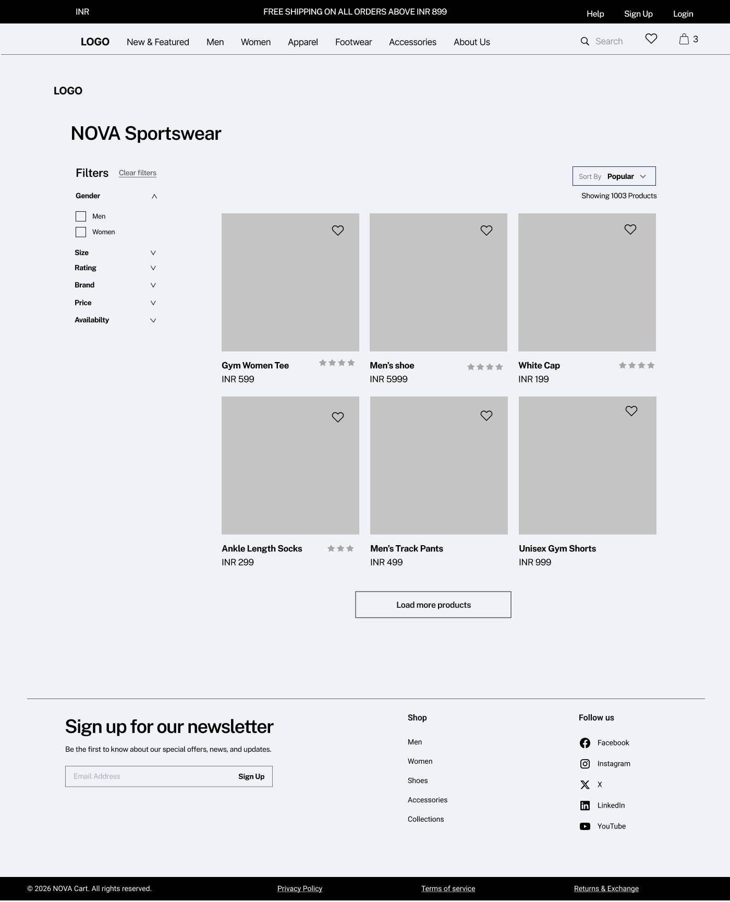

## User Journey Overview

This section outlines the end-to-end customer journey across the platform, covering discovery, purchase, and post-purchase lifecycle.

---

## Journey Flow

Homepage → Product Listing → Product Detail → Cart → Authentication → Checkout → Payment → Confirmation → Order Tracking → Returns

---

## 1. Homepage (Landing Page)

### Overview

The homepage serves as the primary entry point for users, enabling product discovery, category navigation, and promotional engagement.

---

### Wireframe

---

### UI Components

- Top navigation bar:
  - Logo (NOVA)
  - Category links (Men, Women, Apparel, Footwear, Accessories)
  - Search
  - Wishlist icon
  - Cart icon
  - Login / Signup

- Hero banner (carousel)

- Featured section
  - Highlighted categories/products
  - "Shop All" CTA

- Shop by Sport section
  - Category navigation (Running, Training, Badminton)

- Best Sellers section
  - Popular products with pricing

- Newsletter signup

- Footer (policies, returns, contact)

---

### System Behavior

- Navigation redirects to respective listing pages
- Search enables keyword-based discovery
- Product clicks navigate to PDP
- Wishlist and cart icons reflect real-time counts
- Carousel supports manual/auto navigation

---

### Business Logic

- Featured and Best Sellers are driven by:
  - Sales performance
  - Merchandising rules
- Categories map to predefined taxonomy
- Newsletter captures user emails

---

### Edge Cases

- No featured products → fallback content
- Search returns no results → empty state page
- Broken product links → fallback handling
- Cart/wishlist sync issues
- Slow banner load → static fallback

---

### Product Thinking

- Drives discovery and engagement
- Uses visual hierarchy to guide users
- Highlights high-performing products to boost conversion
- Reduces friction via quick navigation
- ---

## 2. Product Listing Page (PLP)

### Overview

The Product Listing Page (PLP) displays a collection of products based on selected category, search query, or applied filters. It enables users to browse, refine, and compare products efficiently before proceeding to product detail.

---

### Wireframe

---

### UI Components

**Top Section:**
- Category title (e.g., NOVA Sportswear)
- Product count (e.g., Showing 1003 products)
- Sort dropdown (Popular, Price Low to High, Price High to Low, Newest)

**Filter Panel (Left):**
- Gender
- Size
- Rating
- Brand
- Price range
- Availability
- Clear filters option

**Product Grid:**
- Product image
- Product name
- Price
- Ratings
- Wishlist icon

**Pagination / Load More:**
- "Load more products" CTA

---

### System Behavior

- Default sorting applied (e.g., Popular)
- Filters dynamically update product list
- Multiple filters can be applied simultaneously
- Filter state persists during session
- Wishlist updates in real-time
- Clicking product navigates to PDP
- Load more fetches next set of products

---

### Business Logic

- Product listing is driven by:
  - Category taxonomy
  - Search query
  - Filter conditions
- Sorting logic:
  - Popular → based on sales/engagement
  - Price → ascending/descending
- Inventory-aware display:
  - Out-of-stock items may be hidden or deprioritized
- Ratings aggregated from user reviews

---

### Key Validations

- Filter combinations should return valid product sets
- Invalid filter combinations → show empty state
- Sorting should not break filter logic
- Price filters must respect min/max constraints

---

### Edge Cases

- No products available → show empty state with suggestions
- Filters result in zero products
- Network delay → loading skeleton UI
- Product image fails → fallback image
- Wishlist sync delay
- Large product sets → performance handling (pagination/lazy load)

---

### Product Thinking

- Enables efficient product discovery and comparison
- Reduces cognitive load using filters and sorting
- Drives conversion by surfacing relevant products
- Prevents drop-offs through clear navigation and feedback
- Supports scalability with large product catalogs
---

## 3. Product Detail Page (PDP)

### Overview

The Product Detail Page (PDP) provides detailed information about a selected product, enabling users to evaluate, compare, and make purchase decisions. It is a critical conversion point in the user journey.

---

### Wireframe

---

### UI Components

**Product Media Section:**
- Image gallery with thumbnails
- Zoom/hover preview (optional)

**Product Information:**
- Product name
- Price
- Ratings and review count
- Short description
- Key highlights (bullet points)

**Purchase Actions:**
- Quantity selector (+ / -)
- Add to Cart CTA
- Buy Now CTA

**Delivery Information:**
- Pincode input
- Delivery estimate
- Shipping details

**Product Details Tabs:**
- Description
- Material & Care
- Reviews

**Reviews Section:**
- Rating breakdown
- User comments
- Add review option

**Recommendations:**
- “You may also like” products

---

### System Behavior

- Product data loads dynamically based on selected item
- Selecting quantity updates cart intent
- Add to Cart updates cart in real-time
- Buy Now redirects to checkout flow
- Pincode check fetches delivery estimate
- Reviews load dynamically (lazy loading)
- Wishlist icon toggles product state

---

### Business Logic

- Pricing includes:
  - Base price
  - Discounts (if applicable)
- Ratings calculated from aggregated user reviews
- Inventory validation before adding to cart
- Delivery estimate based on location (pincode logic)
- Recommendation engine:
  - Similar products
  - Recently viewed / popular items

---

### Key Validations

- Quantity cannot be less than 1
- Cannot add out-of-stock product to cart
- Pincode must be valid for delivery check
- Review submission requires valid input
- Add to Cart disabled if mandatory selections (e.g., size) are missing

---

### Edge Cases

- Product out of stock
- Invalid pincode entered
- No reviews available
- Image load failure → fallback image
- Price mismatch due to backend update
- Recommendation list empty → fallback products

---

### Product Thinking

- PDP is the primary conversion point
- Combines trust signals (reviews, ratings)
- Reduces uncertainty with delivery info
- Encourages purchase through recommendations
- Provides clear CTAs for both cart and instant purchase
