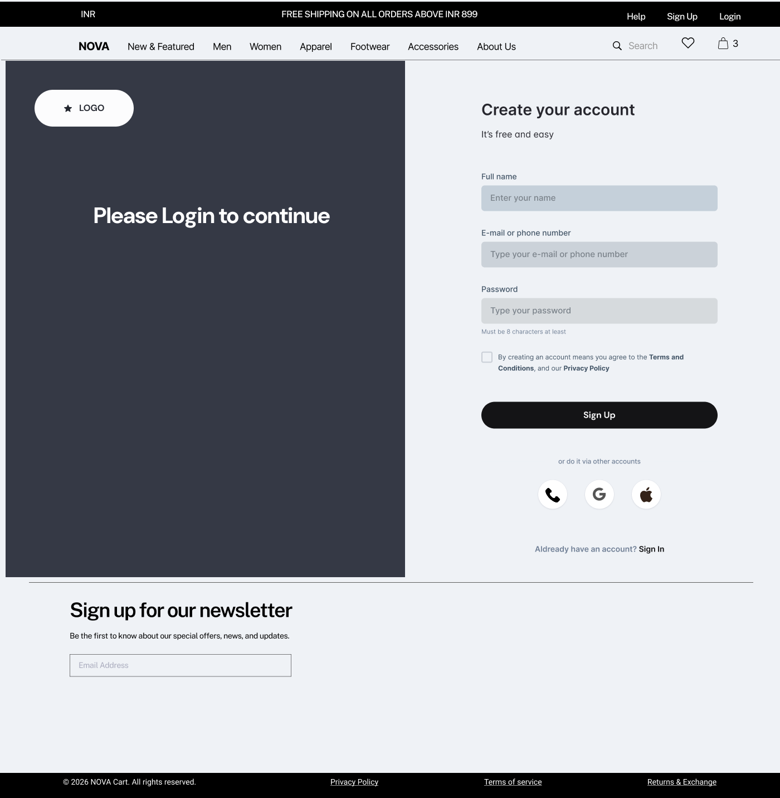
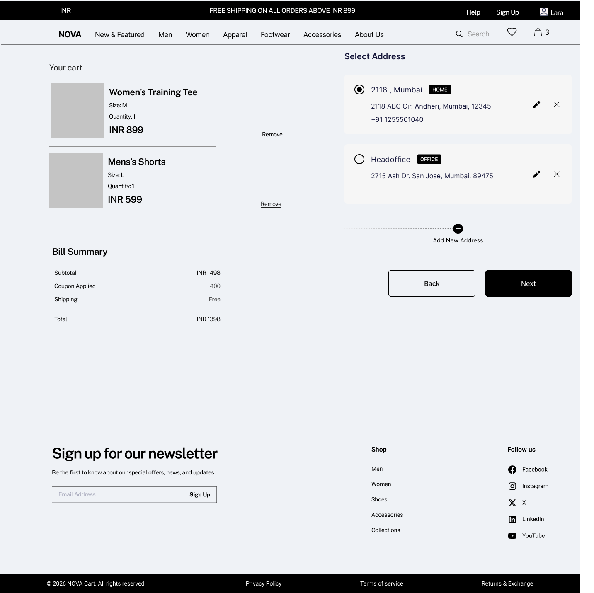

## User Journey Overview

This section outlines the end-to-end customer journey across the platform, covering discovery, purchase, and post-purchase lifecycle.

---

## Journey Flow

Homepage → Product Listing → Product Detail → Cart → Authentication → Checkout → Payment → Confirmation → Order Tracking → Returns

---

## 1. Homepage (Landing Page)

### Overview

The homepage serves as the primary entry point for users, enabling product discovery, category navigation, and promotional engagement.

---

### Wireframe

---

### UI Components

- Top navigation bar:
  - Logo (NOVA)
  - Category links (Men, Women, Apparel, Footwear, Accessories)
  - Search
  - Wishlist icon
  - Cart icon
  - Login / Signup

- Hero banner (carousel)

- Featured section
  - Highlighted categories/products
  - "Shop All" CTA

- Shop by Sport section
  - Category navigation (Running, Training, Badminton)

- Best Sellers section
  - Popular products with pricing

- Newsletter signup

- Footer (policies, returns, contact)

---

### System Behavior

- Navigation redirects to respective listing pages
- Search enables keyword-based discovery
- Product clicks navigate to PDP
- Wishlist and cart icons reflect real-time counts
- Carousel supports manual/auto navigation

---

### Business Logic

- Featured and Best Sellers are driven by:
  - Sales performance
  - Merchandising rules
- Categories map to predefined taxonomy
- Newsletter captures user emails

---

### Edge Cases

- No featured products → fallback content
- Search returns no results → empty state page
- Broken product links → fallback handling
- Cart/wishlist sync issues
- Slow banner load → static fallback

---

### Product Thinking

- Drives discovery and engagement
- Uses visual hierarchy to guide users
- Highlights high-performing products to boost conversion
- Reduces friction via quick navigation
- ---

## 2. Product Listing Page (PLP)

### Overview

The Product Listing Page (PLP) displays a collection of products based on selected category, search query, or applied filters. It enables users to browse, refine, and compare products efficiently before proceeding to product detail.

---

### Wireframe

---

### UI Components

**Top Section:**
- Category title (e.g., NOVA Sportswear)
- Product count (e.g., Showing 1003 products)
- Sort dropdown (Popular, Price Low to High, Price High to Low, Newest)

**Filter Panel (Left):**
- Gender
- Size
- Rating
- Brand
- Price range
- Availability
- Clear filters option

**Product Grid:**
- Product image
- Product name
- Price
- Ratings
- Wishlist icon

**Pagination / Load More:**
- "Load more products" CTA

---

### System Behavior

- Default sorting applied (e.g., Popular)
- Filters dynamically update product list
- Multiple filters can be applied simultaneously
- Filter state persists during session
- Wishlist updates in real-time
- Clicking product navigates to PDP
- Load more fetches next set of products

---

### Business Logic

- Product listing is driven by:
  - Category taxonomy
  - Search query
  - Filter conditions
- Sorting logic:
  - Popular → based on sales/engagement
  - Price → ascending/descending
- Inventory-aware display:
  - Out-of-stock items may be hidden or deprioritized
- Ratings aggregated from user reviews

---

### Key Validations

- Filter combinations should return valid product sets
- Invalid filter combinations → show empty state
- Sorting should not break filter logic
- Price filters must respect min/max constraints

---

### Edge Cases

- No products available → show empty state with suggestions
- Filters result in zero products
- Network delay → loading skeleton UI
- Product image fails → fallback image
- Wishlist sync delay
- Large product sets → performance handling (pagination/lazy load)

---

### Product Thinking

- Enables efficient product discovery and comparison
- Reduces cognitive load using filters and sorting
- Drives conversion by surfacing relevant products
- Prevents drop-offs through clear navigation and feedback
- Supports scalability with large product catalogs
---

## 3. Product Detail Page (PDP)

### Overview

The Product Detail Page (PDP) provides detailed information about a selected product, enabling users to evaluate, compare, and make purchase decisions. It is a critical conversion point in the user journey.

---

### Wireframe

---

### UI Components

**Product Media Section:**
- Image gallery with thumbnails
- Zoom/hover preview (optional)

**Product Information:**
- Product name
- Price
- Ratings and review count
- Short description
- Key highlights (bullet points)

**Purchase Actions:**
- Quantity selector (+ / -)
- Add to Cart CTA
- Buy Now CTA

**Delivery Information:**
- Pincode input
- Delivery estimate
- Shipping details

**Product Details Tabs:**
- Description
- Material & Care
- Reviews

**Reviews Section:**
- Rating breakdown
- User comments
- Add review option

**Recommendations:**
- “You may also like” products

---

### System Behavior

- Product data loads dynamically based on selected item
- Selecting quantity updates cart intent
- Add to Cart updates cart in real-time
- Buy Now redirects to checkout flow
- Pincode check fetches delivery estimate
- Reviews load dynamically (lazy loading)
- Wishlist icon toggles product state

---

### Business Logic

- Pricing includes:
  - Base price
  - Discounts (if applicable)
- Ratings calculated from aggregated user reviews
- Inventory validation before adding to cart
- Delivery estimate based on location (pincode logic)
- Recommendation engine:
  - Similar products
  - Recently viewed / popular items

---

### Key Validations

- Quantity cannot be less than 1
- Cannot add out-of-stock product to cart
- Pincode must be valid for delivery check
- Review submission requires valid input
- Add to Cart disabled if mandatory selections (e.g., size) are missing

---

### Edge Cases

- Product out of stock
- Invalid pincode entered
- No reviews available
- Image load failure → fallback image
- Price mismatch due to backend update
- Recommendation list empty → fallback products

---

### Product Thinking

- PDP is the primary conversion point
- Combines trust signals (reviews, ratings)
- Reduces uncertainty with delivery info
- Encourages purchase through recommendations
- Provides clear CTAs for both cart and instant purchase
  ---

## 4. Cart

### Overview

The Cart page allows users to review selected products, modify quantities and proceed towards checkout. It serves as the transition point from product exploration to purchase intent.

---

### Wireframe

---

### UI Components

**Cart Items Section:**
- Product image
- Product name
- Selected attributes (size, variant)
- Price
- Quantity selector (+ / -)
- Remove item option

**Order Summary Section:**
- Subtotal
- Shipping (calculated later)
- Total amount
- Coupon section (login gated)
- Continue to Checkout CTA

**Additional Information:**
- Return policy
- Shipping details

---

### System Behavior

- Cart persists for logged-in users
- Guest users can add and modify items in cart
- Quantity updates dynamically update pricing
- Removing item updates cart instantly
- Clicking "Continue to checkout":
  - If user NOT logged in → redirect to login/signup
  - After login → redirect back to checkout
- Coupon application enabled only after login

---

### Business Logic

- Subtotal = sum of (price × quantity)
- Shipping calculated at checkout stage
- Coupons:
  - Visible but restricted for guest users
  - Applied only after authentication
- Cart acts as a temporary state before order creation

---

### Key Validations

- Quantity cannot be less than 1
- Cannot proceed to checkout if cart is empty
- Coupon cannot be applied without login
- Price updates must reflect real-time changes

---

### Edge Cases

- Cart is empty → show empty cart state with CTA
- Item goes out of stock while in cart
- Price changes before checkout
- Coupon invalid after login
- Cart data loss for guest users (session expiry)

---

### Product Thinking

- Allows users to review and edit before committing
- Introduces pricing transparency
- Uses login gating strategically at checkout
- Reduces friction by allowing guest browsing
- Encourages conversion via clear CTA and summary
---

## 5. Authentication (Login / Signup)

### Overview

Authentication is required before checkout to capture user details, enable order tracking, and ensure a seamless purchase experience. Users can browse and add items to cart as guests, but must log in to proceed with checkout.

---

### Wireframe

---

### UI Components

**Login / Signup Screen:**
- Full name (for signup)
- Email or phone number input
- Password input
- Terms & conditions checkbox
- Sign up CTA
- Sign in CTA (for existing users)

**Alternate Login Options:**
- Phone OTP login
- Social login (Google, Apple)

**OTP Verification Modal:**
- OTP input (4-digit)
- Verify CTA
- Resend OTP option

---

### System Behavior

- Users can browse platform without login
- Login is triggered when:
  - User clicks "Continue to checkout"
  - User tries to apply coupon
- After successful login:
  - User is redirected back to checkout
- OTP is sent to registered mobile/email
- OTP verification completes authentication
- Session is maintained for logged-in users

---

### Business Logic

- Login is mandatory for order placement
- Guest users are converted to authenticated users at checkout
- OTP-based login reduces friction compared to password-only login
- Social login improves onboarding speed
- User data (address, orders, preferences) is linked post-login

---

### Key Validations

- Email/phone format validation
- Password must meet minimum criteria
- OTP must be valid and within time limit
- Terms & conditions must be accepted during signup

---

### Edge Cases

- Invalid OTP entered
- OTP expired
- Network delay in OTP delivery
- Duplicate account (same email/phone)
- User drops off during login
- Session timeout after inactivity

---

### Product Thinking

- Balances friction and conversion by delaying login requirement
- Uses OTP to simplify authentication
- Ensures data capture before checkout
- Minimizes drop-offs with seamless redirect post-login
- Supports multiple login methods for flexibility
### Address Selection & Validation

#### Wireframe

**Checkout – Initial State**

**Address Selection Screen**

---

#### Overview

The address selection in checkout follows a two-step interaction model to ensure delivery accuracy. While a default address is pre-selected for convenience, the user must explicitly confirm the address before proceeding.

---

#### Interaction Flow

1. User lands on checkout screen
2. "Select Delivery Address" CTA is displayed
3. User clicks CTA
4. Address selection screen opens
5. Default address is pre-selected
6. User must explicitly confirm or change the address
7. User clicks "Next" to proceed

---

#### UI Components

**Initial Checkout Screen:**
- Cart summary
- Coupons & offers section
- Bill summary (subtotal, discount, shipping, total)
- "Select Delivery Address" CTA
- Continue CTA (disabled until address confirmed)

**Address Selection Screen:**
- List of saved addresses
- Address label (Home, Office, etc.)
- Full address details
- Phone number
- Pre-selected default address (radio button)
- Edit address option
- Delete address option
- Add new address CTA
- Navigation CTAs:
  - Back
  - Next

---

#### System Behavior

- Default address is pre-selected but NOT auto-confirmed
- User must explicitly select/confirm an address
- Only one address can be selected at a time
- Clicking "Next" confirms address and returns to checkout
- Checkout CTA is enabled only after address confirmation

---

#### Validation Logic

- Address confirmation is mandatory before proceeding
- If user tries to proceed without selecting/confirming address:
  - System blocks progression
  - Displays inline error message:
    **"Please select a delivery address to proceed"**

- Validation is triggered on CTA click

---

#### Error Handling (UX Behavior)

- Error is shown inline near address section
- No page refresh or disruptive UI behavior
- No layout shifts ("jumpy" experience avoided)
- Clear guidance provided to user

---

#### Business Logic

- Prevents incorrect order placement to unintended address
- Reduces delivery failures and return-to-origin (RTO)
- Ensures delivery feasibility before payment
- Default selection improves speed, confirmation ensures accuracy

---

#### Edge Cases

- No saved addresses → force user to add new address
- User deletes default address → next available becomes default
- Address not serviceable (invalid pincode)
- User edits address during checkout
- Multiple similar addresses causing confusion

---

#### Product Thinking

- Uses a two-step confirmation model to reduce user errors
- Balances speed (default selection) with control (mandatory confirmation)
- Improves delivery success rate and operational efficiency
- Ensures critical data validation before payment

### Coupons & Offers

#### Overview

The Coupons & Offers section enables users to apply discounts during checkout. It supports both manual coupon entry and selection from system-generated eligible offers to improve usability and conversion.

---

#### Wireframe

---

#### UI Components

- Coupon input field (manual entry)
- Apply CTA
- Tabs:
  - All Coupons
  - Eligible Coupons
  - Payment Offers
- Coupon cards:
  - Coupon code (e.g., SAVE100)
  - Description (offer details)
  - Apply / Applied CTA
- Inactive coupons (grayed out)
- Savings summary (e.g., “₹200 savings applied”)
- Continue CTA

---

#### System Behavior

- Users can apply coupons in two ways:

  1. **Manual Entry:**
     - User enters coupon code in input field
     - Clicks "Apply"
     - System validates and applies if eligible

  2. **Selection from Available Coupons:**
     - User views list of coupons
     - Clicks "Apply" on a coupon card
     - System validates and applies instantly

- Eligible coupons are highlighted
- Ineligible coupons are shown but disabled
- Only one coupon can be applied at a time
- Applying a coupon:
  - Updates discount instantly
  - Reflects in bill summary
- Removing coupon recalculates total
- Coupon state persists during checkout session

---

#### Business Logic

- Coupon eligibility based on:
  - Minimum cart value
  - Product/category constraints
  - User eligibility (e.g., first-time user)
- Discount types:
  - Flat discount (₹100 off)
  - Percentage discount
- Coupons may be:
  - Auto-applied
  - User-applied
- Payment offers:
  - Applied only when eligible payment method is used

---

#### Key Validations

- Coupon must meet eligibility criteria
- Only one coupon allowed at a time
- Expired coupons cannot be applied
- Invalid coupon code shows error
- Coupon is revalidated on cart changes

---

#### Edge Cases

- Coupon becomes invalid after cart update
- Multiple coupons conflict
- Coupon applied but payment method not eligible
- Network failure during coupon validation
- User navigates back and loses coupon state

---

#### Error Handling

- Invalid coupon:
  - Show inline error message
- Expired coupon:
  - Show “Coupon expired”
- Ineligible coupon:
  - Show reason (e.g., “Minimum order ₹1299 required”)

---

#### Product Thinking

- Provides flexibility with manual and assisted coupon application
- Encourages conversion through visible savings
- Highlights best eligible coupons to reduce user effort
- Uses inactive coupons to nudge higher cart value
- Ensures pricing transparency and trust
