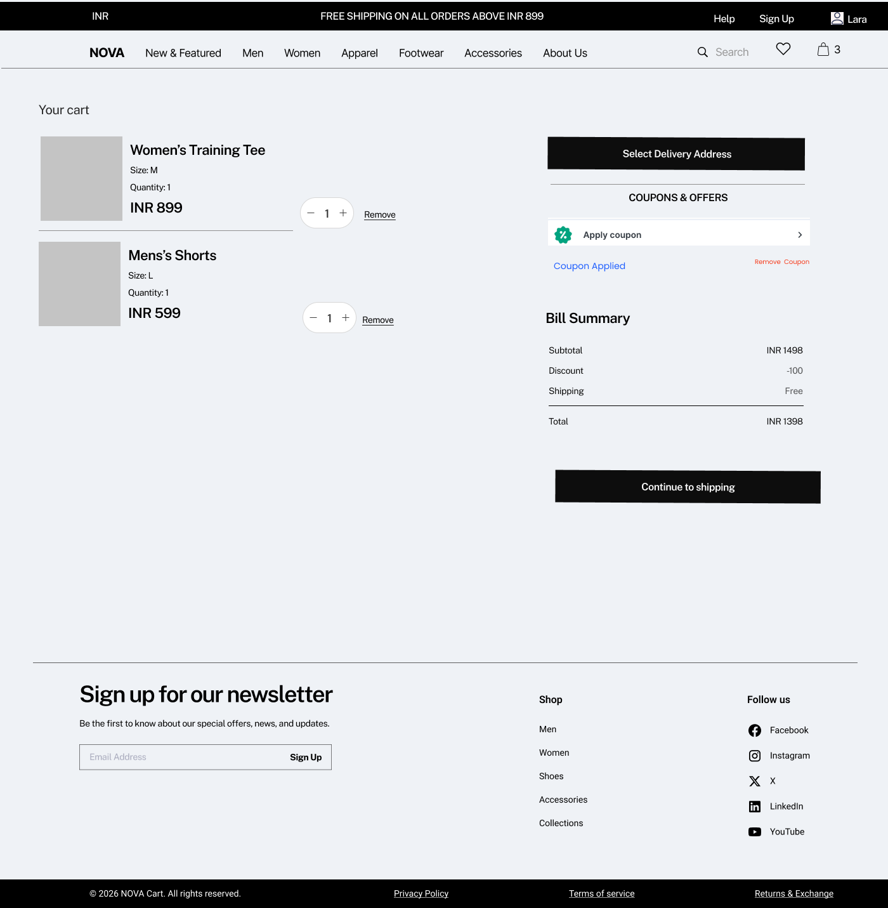
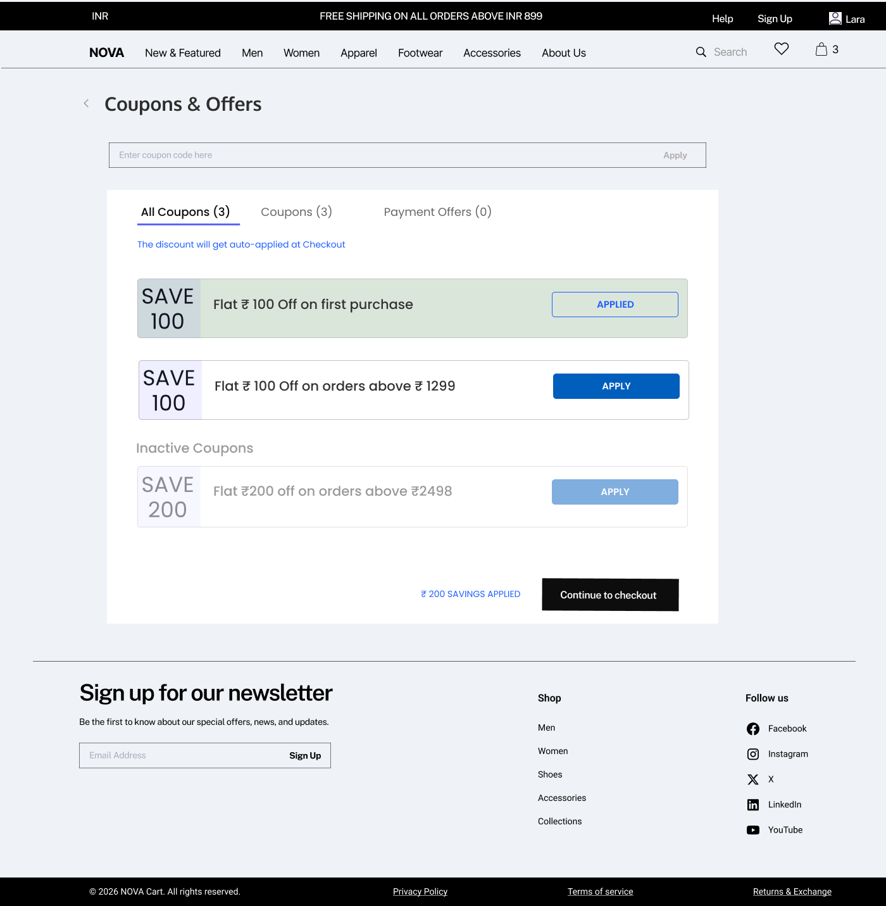
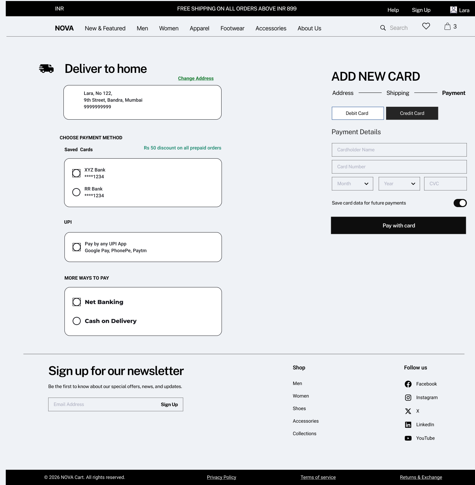

# Checkout Experience

## Overview

The checkout experience is the final stage of the purchase journey where users provide delivery details, apply offers, validate pricing, and complete payment. This module ensures accuracy, transparency, and successful order placement.

---

## Checkout Flow

Cart → Authentication → Address Selection → Coupon Application → Pricing Validation → Payment → Order Confirmation

---

## 1. Address Selection & Validation

### Overview

The address selection follows a two-step interaction model to ensure delivery accuracy. While a default address is pre-selected for convenience, the user must explicitly confirm the address before proceeding.

---

### Wireframe

**Checkout – Initial State**

**Address Selection Screen**

---

### System Behavior

- Default address is pre-selected but NOT auto-confirmed
- User must explicitly confirm address
- Only one address can be selected at a time
- Address selection is mandatory before proceeding

---

### Validation Logic

- Block checkout if no address is selected
- Show inline error:
  **"Please select a delivery address to proceed"**

---

### Business Logic

- Prevents incorrect deliveries
- Ensures delivery feasibility before payment
- Reduces return-to-origin (RTO)

---

### Edge Cases

- No saved addresses → force add new address
- Address not serviceable (pincode restriction)
- User edits or deletes address mid-checkout

---

## 2. Coupons & Offers

### Overview

Users can apply discounts either manually or by selecting from available coupons.

---

### Wireframe

---

### System Behavior

- Users can apply coupons in two ways:

  1. Manual entry via coupon input field  
  2. Selection from available coupon list  

- Eligible coupons are highlighted
- Ineligible coupons are disabled
- Only one coupon can be applied at a time
- Applying coupon updates pricing instantly
- Removing coupon recalculates total

---

### Business Logic

- Coupon eligibility based on:
  - Minimum cart value
  - Product/category constraints
  - User eligibility (e.g., first-time user)

- Supports:
  - Flat discounts
  - Percentage discounts

- Payment offers:
  - Applied only when eligible payment method is selected

---

### Validation Logic

- Invalid or expired coupons cannot be applied
- Coupon is revalidated on cart updates
- Only one coupon allowed at a time

---

### Edge Cases

- Coupon becomes invalid after cart change
- Payment method mismatch for bank offers
- Network failure during coupon validation

---

## 3. Pricing & Billing

### Overview

The pricing module calculates the final payable amount based on cart value, discounts, and shipping rules.

---

### System Behavior

- Subtotal = sum of (item price × quantity)
- Discount applied based on coupon
- Shipping calculated based on threshold
- Final total updated dynamically

---

### Business Logic

- Free shipping above threshold (e.g., INR 899)
- Prepaid discounts may apply
- Taxes included in final pricing

---

### Validation Logic

- Pricing must refresh on any cart change
- Prevent mismatch between frontend and backend pricing

---

### Edge Cases

- Price updated after inventory or backend sync
- Shipping not available for location

---

## 4. Payment

### Overview

The payment step enables users to complete the transaction using multiple payment methods. It supports saved payment options, new payment entry, and real-time validation based on applied offers.

---

### Wireframe

---

### System Behavior

- User can:
  - Select from saved payment methods
  - Add a new payment method
- Address can be changed directly from payment screen
- Payment method selection updates applicable offers dynamically
- On clicking “Pay”:
  - Redirect to payment gateway (if applicable)
  - Await success/failure response

---

### Business Logic

- Supports:
  - Cards
  - UPI
  - Net Banking
  - Cash on Delivery (COD)

- Prepaid incentives may apply
- Bank/UPI offers:
  - Applied only if correct payment method is used

- Order is created only after successful payment (except COD)

---

### Validation Logic

- Payment method selection is mandatory
- Card details must be valid
- If coupon is tied to a payment method:
  - Validate against selected method
  - Block or show error if mismatch

---

### Error Handling

- Payment failure → show retry option
- Gateway timeout → show pending state
- Coupon-payment mismatch:
  **"Selected offer is not applicable for this payment method"**
- Invalid card → field-level errors

---

### Edge Cases

- Payment success but order not created
- Double payment attempts
- User exits mid-payment
- Network failure
- COD unavailable for location
- Expired saved cards

---

## 5. Order Confirmation

### Overview

After successful payment, the system confirms the order and communicates it to the user.

---

### System Behavior

- Order ID generated
- Confirmation screen displayed
- Email/SMS sent
- Invoice generated

---

### Business Logic

- Inventory deducted after payment
- Order status set to "Placed"

---

### Edge Cases

- Payment success but confirmation fails
- Notification failure
- Duplicate order prevention

