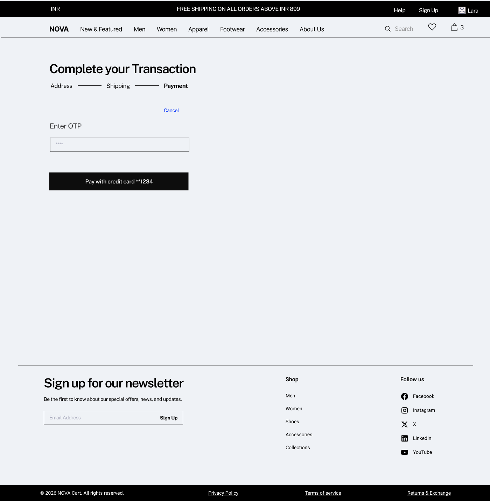
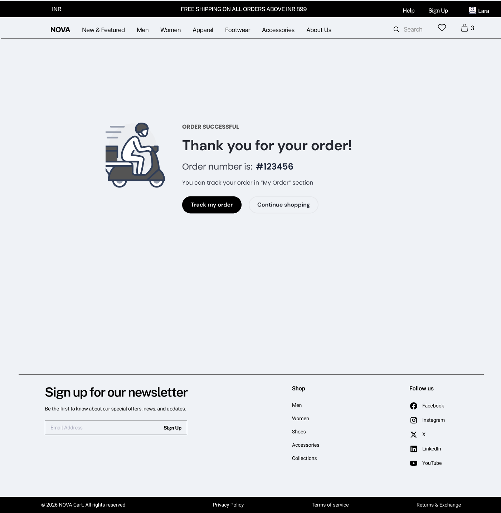

# Checkout Experience

## Overview

The checkout experience is the final stage of the purchase journey where users provide delivery details, apply offers, validate pricing, and complete payment. This module ensures accuracy, transparency, and successful order placement.

---

## Checkout Flow

Cart → Authentication → Address → Coupons → Pricing → Payment → Order Confirmation

---

## 1. Address Selection & Validation

### Overview

The address selection follows a two-step interaction model to ensure delivery accuracy. While a default address is pre-selected for convenience, the user must explicitly confirm the address before proceeding.

---

### Wireframe

  

---

### System Behavior

- Default address is pre-selected but NOT auto-confirmed  
- User must explicitly confirm address  
- Only one address can be selected at a time  
- Address selection is mandatory before proceeding  

---

### Business Logic

- Prevents incorrect deliveries  
- Ensures delivery feasibility before payment  
- Reduces return-to-origin (RTO)  

---

### Validation Logic

- Block checkout if no address is selected  
- Show inline error:  
  **"Please select a delivery address to proceed"**

---

## 2. Coupons & Offers

### Overview

Users can apply discounts either manually or by selecting from available coupons.

---

### Wireframe

---

### System Behavior

- Two methods:
  - Manual coupon entry  
  - Selection from available list  
- Only one coupon allowed at a time  
- Pricing updates instantly on apply/remove  

---

### Business Logic

- Eligibility based on:
  - Cart value  
  - Product/category  
  - User type  

- Supports:
  - Flat discounts  
  - Percentage discounts  

- Payment offers depend on selected payment method  

---

### Validation Logic

- Invalid/expired coupons rejected  
- Coupon revalidated on cart updates  

---

## 3. Pricing & Billing

### Overview

Calculates final payable amount based on cart value, discounts, and shipping rules.

---

### System Behavior

- Subtotal = item price × quantity  
- Discount applied via coupon  
- Shipping calculated based on threshold  
- Total updated dynamically  

---

### Business Logic

- Free shipping above threshold  
- Prepaid discounts may apply  
- Taxes included in final price  

---

### Validation Logic

- Pricing refreshes on any change  
- Prevent frontend-backend mismatch  

---

## 4. Payment

### Overview

Users complete the transaction using multiple payment methods with secure authentication and real-time validation.

---

### Wireframe

  

---

### System Behavior

- User can:
  - Select saved payment method  
  - Add new payment method  
- Address can be edited during payment  
- Payment triggers gateway interaction  

**Flow:**
1. Click “Pay”  
2. Redirect to gateway  
3. OTP (if applicable)  
4. Success/Failure response  

---

### Business Logic

- Supports:
  - Cards, UPI, Net Banking, COD  
- Prepaid incentives apply  
- Payment-method-based offers enforced  
- Order created only after successful payment (except COD)  

---

### Validation Logic

- Payment method mandatory  
- Card details must be valid  
- OTP must be correct  

- Coupon-payment dependency:
  - Validate selected method  
  - Block if mismatch  

---

## 5. Order Confirmation

### Overview

Final step where system confirms successful order placement and provides next steps.

---

### Wireframe

---

### UI Components

- Success message  
- Order ID  
- Track Order CTA  
- Continue Shopping CTA  

---

### System Behavior

- Triggered after:
  - Successful payment (prepaid)  
  - Order creation (COD)  

- System actions:
  - Generate Order ID  
  - Create order record  
  - Deduct inventory  

- Notifications:
  - Email  
  - SMS  

---

### Business Logic

- Order status set to “Placed”  
- Payment status updated (Paid / Pending)  

---

### Validation Logic

- Prevent duplicate order creation  
- Ensure confirmation only after backend success  

---

## 6. Error Handling & Edge Cases

### Overview

Handles failures across checkout stages to ensure reliability and prevent user drop-offs.

---

### Payment Errors

- Payment failure → show retry option  
- Gateway timeout → show pending state  
- Double payment prevention  

---

### OTP Errors

- Invalid OTP → inline error  
- Expired OTP → resend option  
- OTP delay → retry mechanism  

---

### Coupon Errors

- Invalid/expired coupon  
- Coupon becomes invalid after cart change  
- Payment-method mismatch  

---

### Address Errors

- No address selected  
- Address not serviceable  

---

### System Edge Cases

- Payment success but order not created  
- Network failure during transaction  
- User exits mid-payment  
- Inventory mismatch after checkout  

---

### Product Thinking

- Centralized error handling improves clarity  
- Retry flows reduce drop-offs  
- Clear messaging builds trust  
- Prevents inconsistent system states  
