# Account Management

## Overview

The Account Management module serves as a centralized hub for users to manage their post-purchase journey and personal preferences. It enables users to track orders, initiate returns, manage addresses and payment methods, access support, and update profile details.

The experience is designed to be self-service driven, reducing dependency on customer support while ensuring clarity, control, and transparency.

---

## 1. Navigation & Entry

### Overview

Users can access account-related functionalities through a profile section, typically via a dropdown or sidebar navigation. This acts as the entry point to all account features.

---

### Wireframe

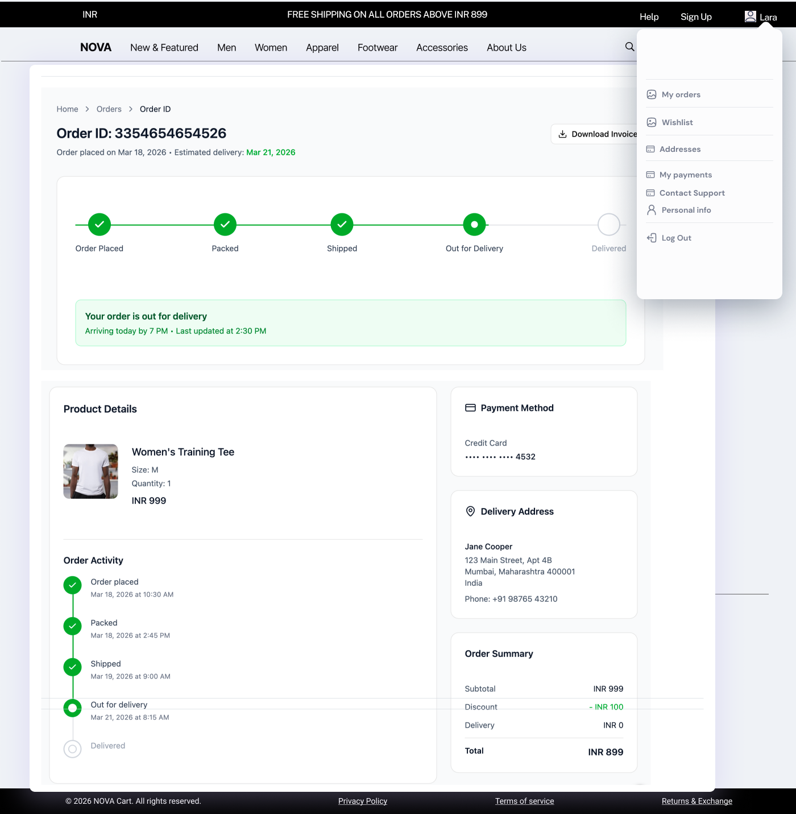

---

### Features

- Centralized navigation for all account sections  
- Quick access to:
  - Orders  
  - Wishlist  
  - Addresses  
  - Payment Methods  
  - Profile  
  - Support  

---

### Logic

- Accessible only for logged-in users  
- Persistent navigation across account sections  
- Active section highlighted  

---

## 2. Order Management

### Overview

Allows users to view, track, and manage all orders with full visibility into order status, details, and actions.

---

### Wireframe

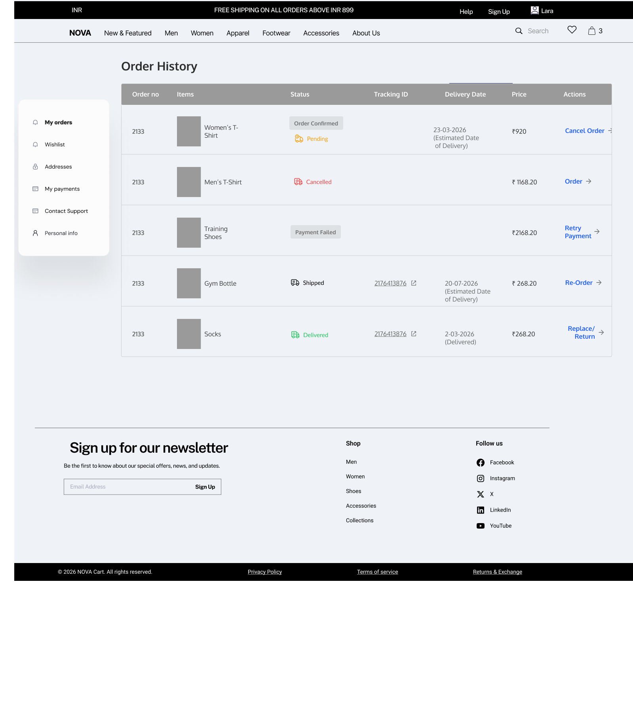

---

### Features

- List of all orders with key details  
- Status indicators:
  - Order Placed  
  - Packed  
  - Shipped  
  - Delivered  
  - Cancelled  
  - Payment Failed  

- Contextual actions:
  - Cancel Order  
  - Retry Payment  
  - Reorder  
  - Return / Replace  

---

### Logic

- Cancel Order available only before packing  
- Retry Payment enabled for failed transactions  
- Return/Replace enabled only after delivery  
- UI adapts based on order status  

---

## Order Details & Tracking

### Overview

Provides a detailed view of a selected order, including real-time tracking, product information, delivery details, and payment summary.

---

### Wireframe

---

### Features

- Visual order progress tracker:
  - Order Placed  
  - Packed  
  - Shipped  
  - Out for Delivery  
  - Delivered  

- Current stage highlighted  
- Delivery status message  
- Estimated delivery date  

- Product details:
  - Image  
  - Name  
  - Size  
  - Quantity  
  - Price  

- Payment method (masked details)  
- Delivery address  
- Order summary (Subtotal, Discount, Delivery, Total)  

- Order activity timeline (timestamps)  
- Download invoice option  

---

### Logic

- Tracker updates dynamically based on status  
- Completed steps marked visually  
- Future steps inactive  
- Activity logs system-generated  

---

### Cancel Order Logic

- “Cancel Order” CTA visible only when:
  - Status = "Order Placed"

- Hidden once order is "Packed"  

- On click:
  - Confirmation modal:
    - “Are you sure you want to cancel this order?”
    - Confirm / Cancel actions  

- On confirmation:
  - Status updated to "Cancelled"  

- Refund Handling:
  - Prepaid → Refund to original method (5–7 days)  
  - COD → No refund required  

- Cancelled orders:
  - Tagged clearly  
  - Only “Reorder” allowed  

---

### UX Behavior

- Cancel CTA shown contextually:
  - Order History → Actions column  
  - Order Details → Near status section  

- Invalid actions are hidden (not shown as errors)  

---

## 3. Returns & Replacement

### Overview

Enables users to initiate return or replacement requests through a structured and validated flow.

---

### Wireframe

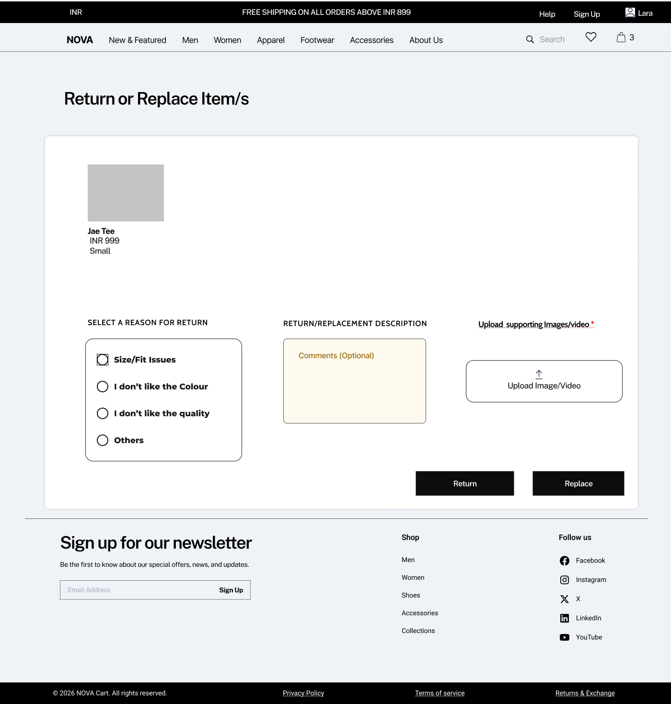  
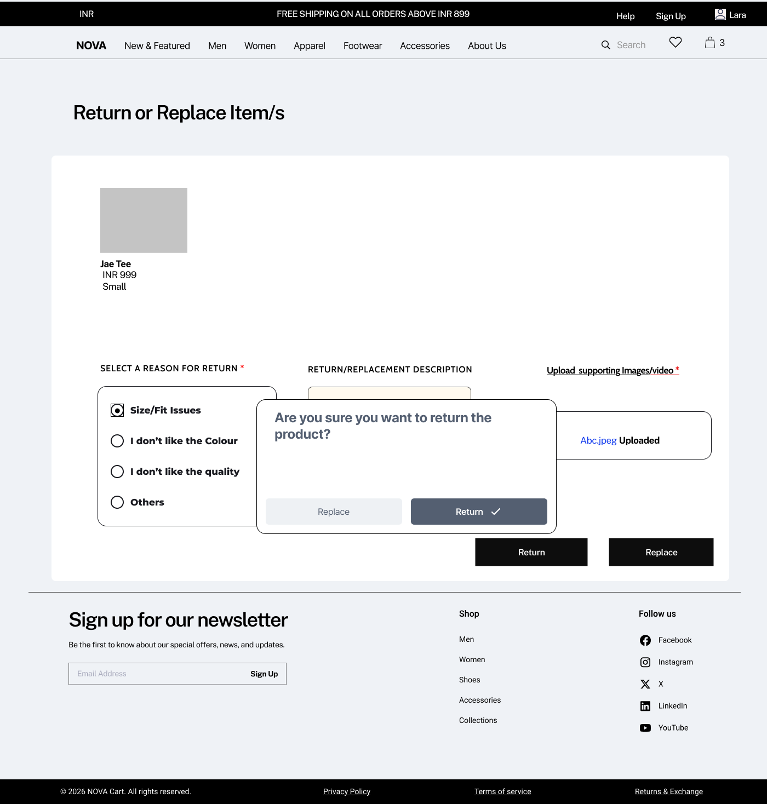  
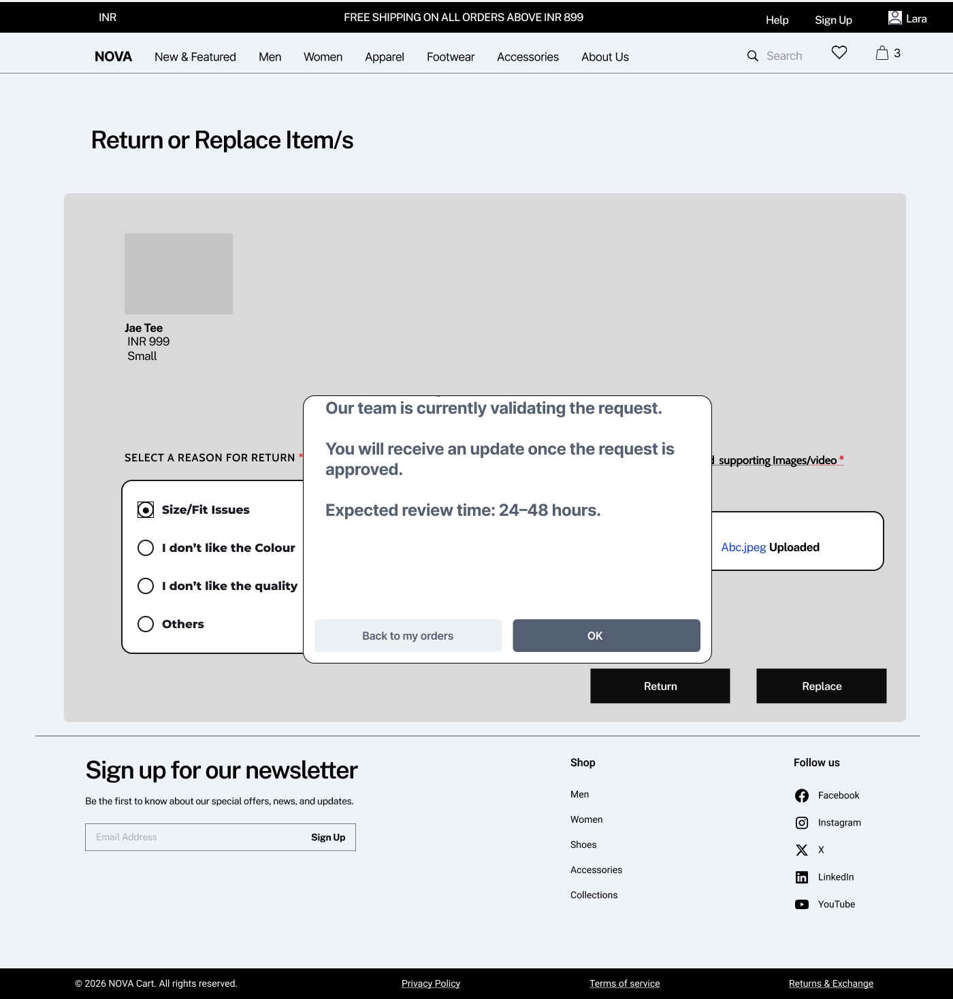

---

### Features

- Reason selection (mandatory)  
- Optional comments  
- Image/video upload (mandatory if required)  
- Return or Replace selection  
- Confirmation before submission  

---

### Logic

- Submission blocked without reason  
- Upload required where applicable  
- Request enters “Under Review” state  
- SLA: 24–48 hours  
- Status updated post validation  

---

## 4. Address Management

### Overview

Allows users to manage delivery addresses for accurate and faster checkout.

---

### Wireframe

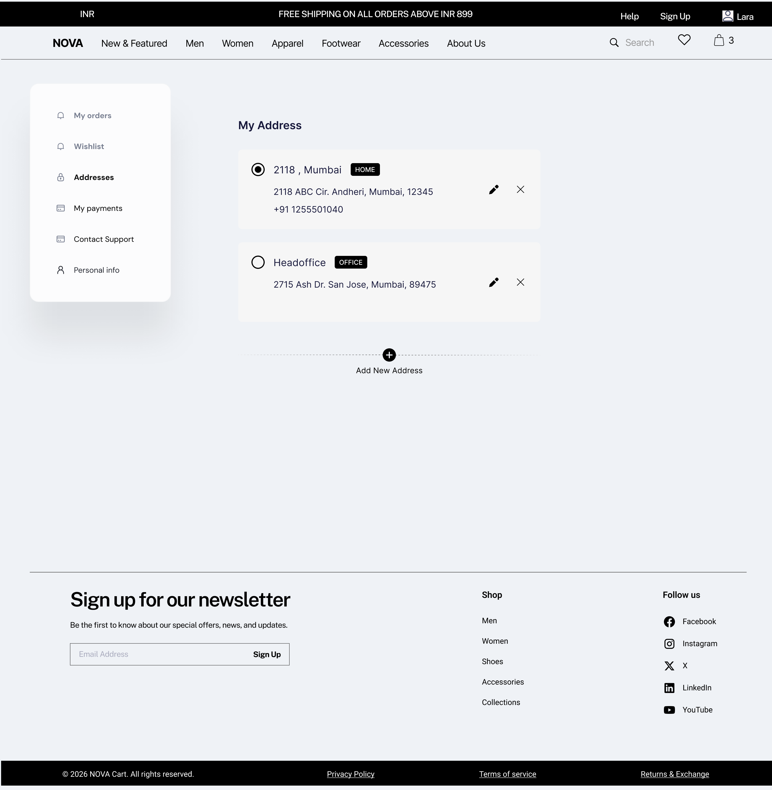

---

### Features

- Add new address  
- Edit address  
- Delete address  
- Set default address  

---

### Logic

- Default address used in checkout  
- Address validation (pincode/serviceability)  
- Minimum one address required  

---

## 5. Payment Methods

### Overview

Users can manage saved payment methods for faster transactions.

---

### Wireframe

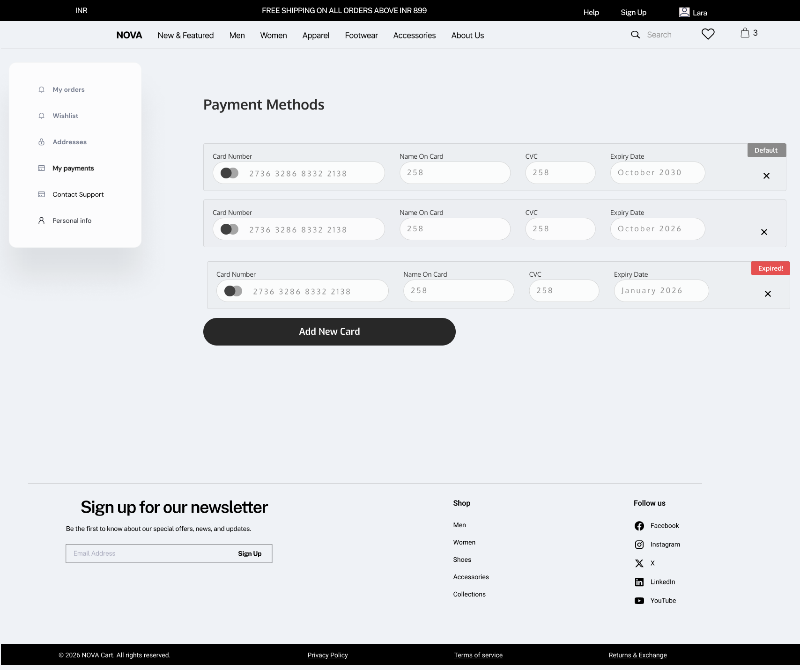

---

### Features

- View saved cards  
- Add new card  
- Delete card  
- Set default card  

---

### Logic

- Expired cards disabled  
- Card details masked  
- Default card prioritized  

---

## 6. Wishlist

### Overview

Allows users to save and manage products for future purchase.

---

### Wireframe

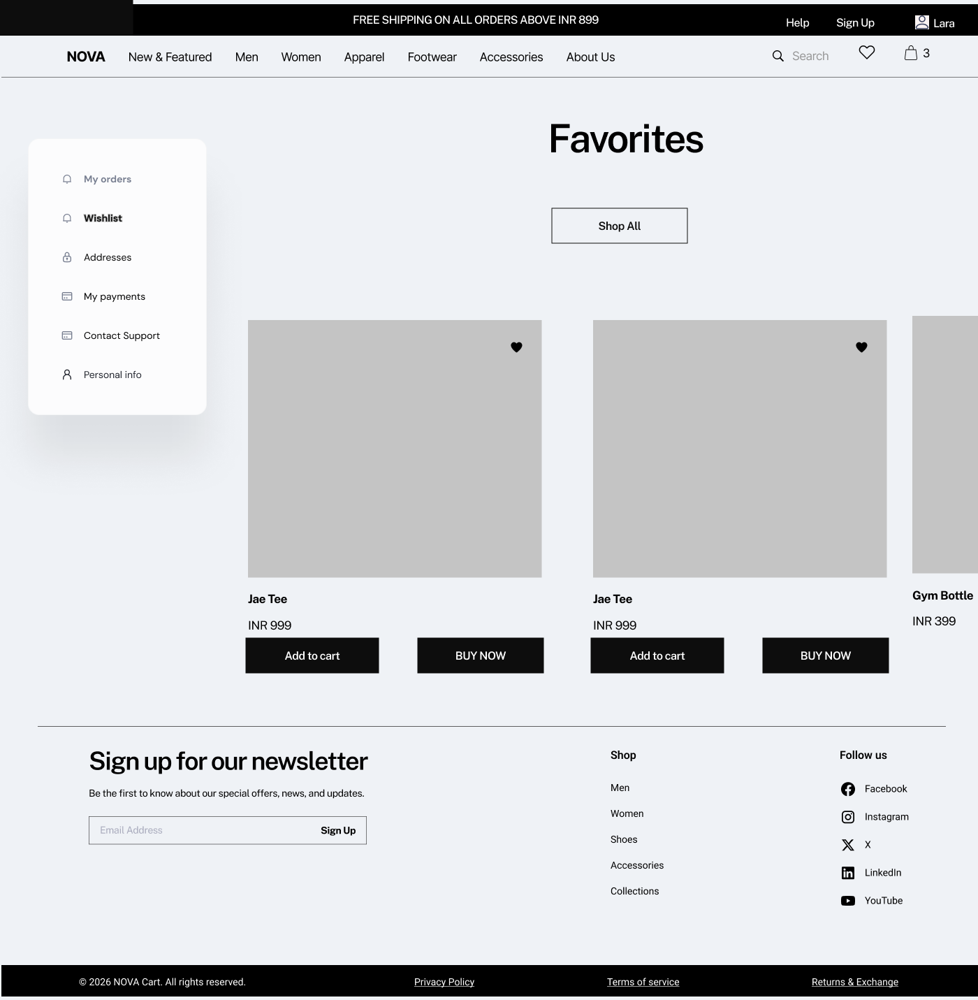

---

### Features

- View saved items  
- Add to cart  
- Remove from wishlist  

---

### Logic

- Persisted for logged-in users  
- Reflects product availability  

---

## 7. Personal Information

### Overview

Users can manage and update their profile details.

---

### Wireframe

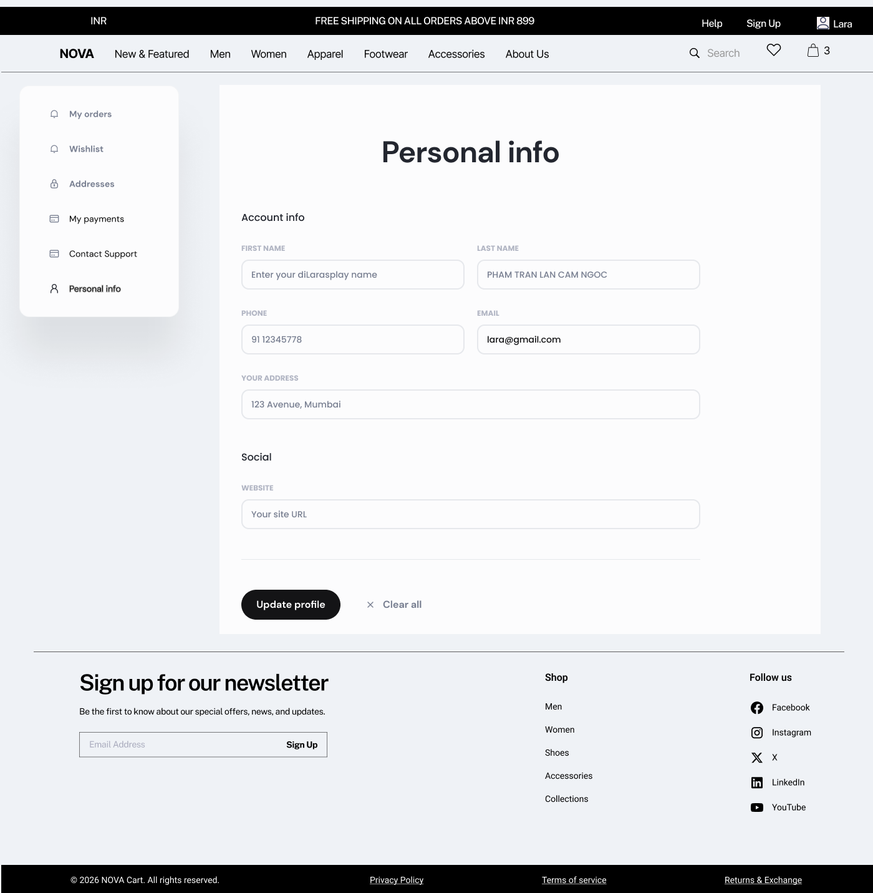

---

### Features

- Edit name, phone, email  
- Update address  
- Save profile  

---

### Logic

- Input validation (email, phone)  
- Changes reflected system-wide  

---

## 8. Customer Support

### Overview

Provides assistance through chat and self-service help.

---

### Wireframe

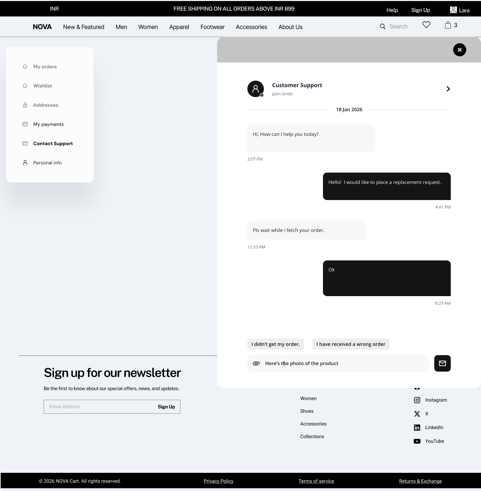  
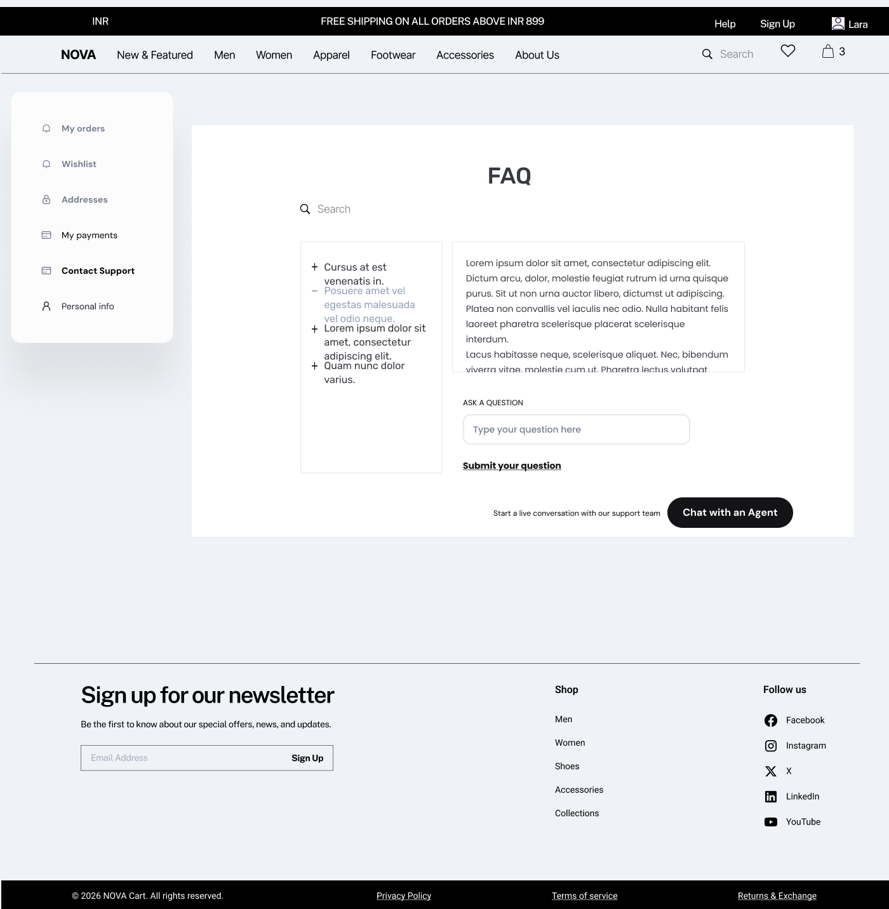

---

### Features

- Chat interface  
- Quick action queries  
- FAQ access  
- Media upload  

---

### Logic

- Order-based queries prioritized  
- Escalation to agent when needed  
- FAQ reduces dependency on support  

---

## Error Handling & Edge Cases

### Overview

Ensures system reliability by handling failures and invalid scenarios gracefully.

---

### Scenarios

- Cancel option hidden after packing  
- Return blocked without required inputs  
- Expired cards disabled  
- Invalid address rejected  
- Payment retry for failed orders  
- Support fallback available  

---

### Product Thinking

- Prevent invalid actions instead of showing errors  
- State-driven UI decisions  
- Self-service reduces support load  
- Clear feedback improves trust  
 

