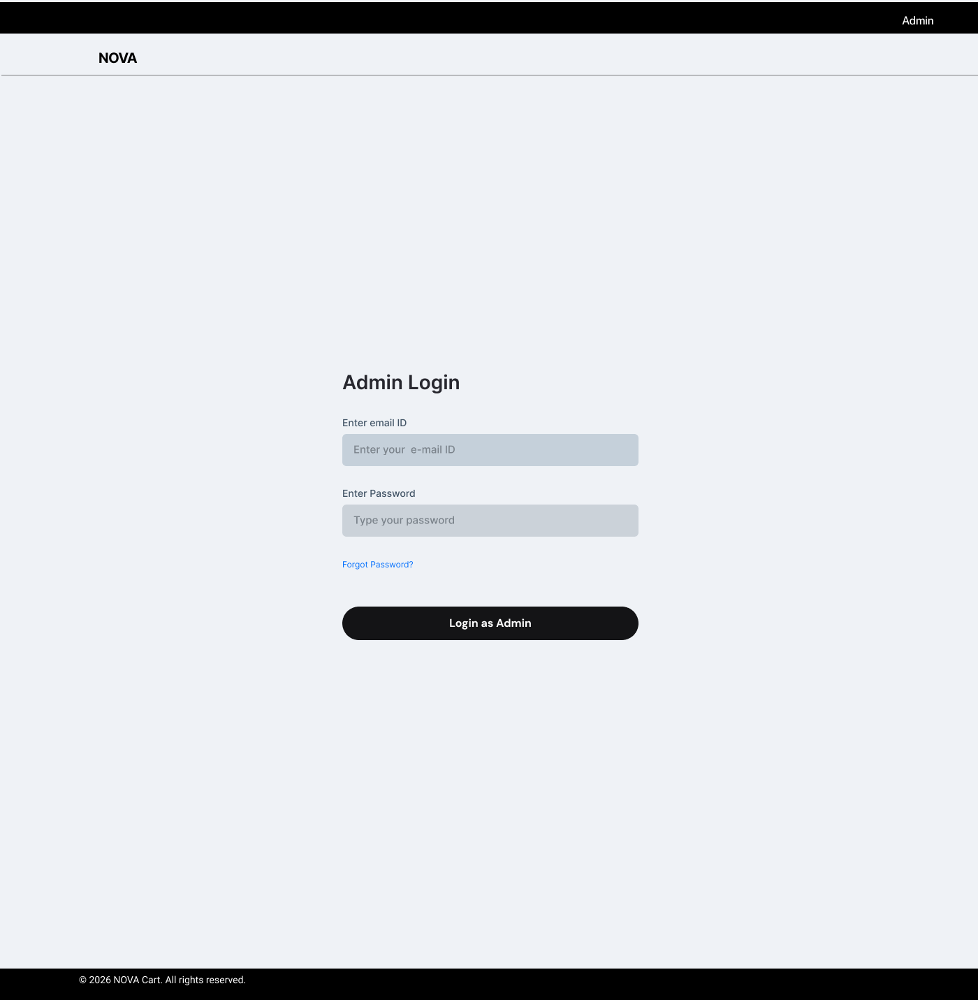
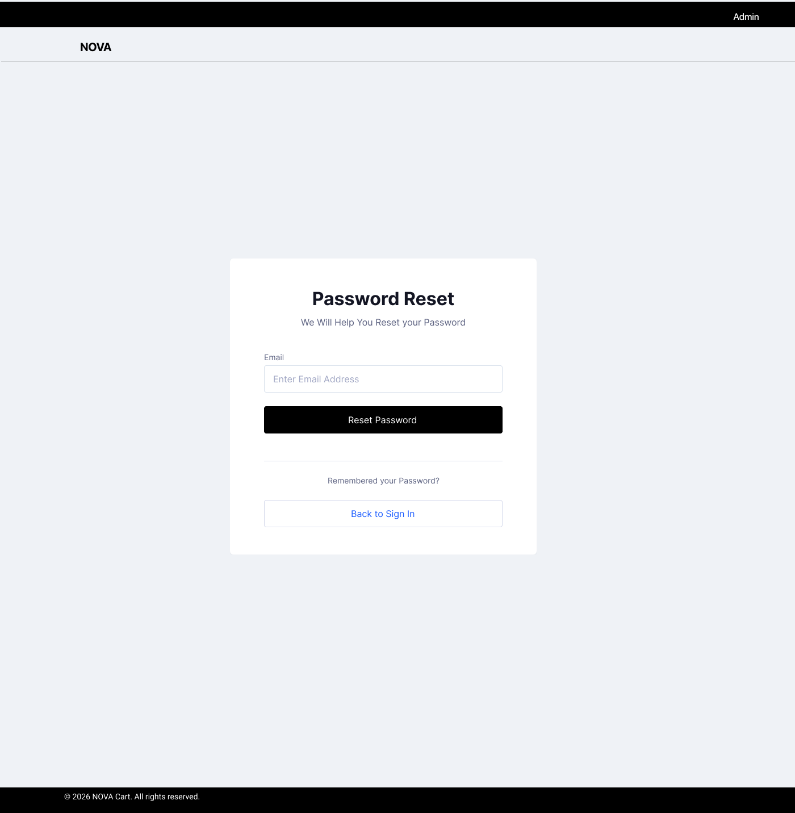

# Admin Authentication

## Overview

The Admin Authentication module handles secure access to the admin panel. It includes login, account creation, password reset, and email verification flows.

This ensures only authorized personnel can access operational controls.

---

## 1. Admin Login

### Overview

Allows admins to securely log into the system.

---

### Wireframe

---

### Features

- Email ID input  
- Password input  
- Forgot password option  
- Login CTA  

---

### Logic

- Validates credentials  
- On success → Redirect to Admin Dashboard  
- On failure → Show error message  

---

## 2. Admin Sign Up

### Overview

Allows creation of new admin accounts.

---

### Wireframe

---

### Features

- Email input  
- Password + Confirm password  
- Terms & Conditions checkbox  
- Create account CTA  

---

### Logic

- Password validation (min 8 characters)  
- Email must be unique  
- On success → Trigger email verification  

---

## 3. Email Verification

### Overview

Confirms admin account via email.

---

### Wireframe

---

### Features

- Confirmation message  
- Resend email option  

---

### Logic

- Account remains inactive until verified  
- Resend option available  

---

## 4. Forgot Password

### Overview

Allows admins to reset their password.

---

### Wireframe

---

### Features

- Email input  
- Reset password CTA  

---

### Logic

- Sends password reset link  
- Token-based secure reset  
- Link expiry for security  

---

## System Logic

- Authentication required before accessing admin panel  
- Role-based access can be extended  
- Secure session management  

---

## Error Handling

- Invalid credentials  
- Email not registered  
- Weak password  
- Expired reset link  
- Unverified account login attempt  

---

## Product Thinking

- Ensures secure backend access  
- Prevents unauthorized usage  
- Aligns with real-world admin systems  
- Scalable for multi-role access in future  

