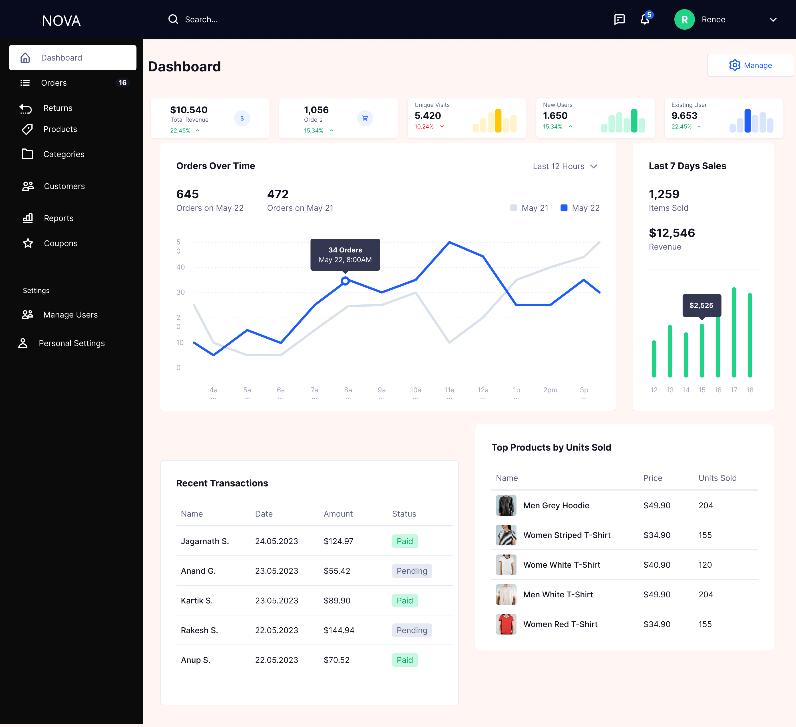

# Admin Dashboard

## Overview

The Admin Dashboard provides a high-level view of platform performance, enabling admins to monitor business metrics, track orders, and make data-driven decisions.

It acts as the central control panel for all admin operations.

---

## Wireframe

---

## Layout Structure

### Top Navigation Bar
- Brand (NOVA)
- Global search
- Notifications icon
- User profile (Admin)

---

### Left Sidebar Navigation

**Primary Modules**
- Dashboard (active)
- Orders
- Returns
- Products
- Categories
- Customers
- Reports
- Coupons

**Settings**
- Manage Users
- Personal Settings

---

### Main Content Area

#### 1. KPI Cards (Top Row)

- Total Revenue  
- Total Orders  
- Unique Visits  
- New Users  
- Existing Users  

Each card includes:
- Metric value  
- % change indicator  
- Visual mini graph  

---

#### 2. Orders Over Time (Center Panel)

- Line chart showing order trends  
- Time filter (e.g., last 12 hours)  
- Hover interaction for detailed values  

---

#### 3. Sales Summary (Right Panel)

- Last 7 days performance  
- Items sold  
- Revenue  
- Bar chart visualization  

---

#### 4. Recent Transactions (Bottom Left)

- Customer name  
- Date  
- Amount  
- Status (Paid / Pending)  

---

#### 5. Top Products (Bottom Right)

- Product name  
- Price  
- Units sold  

---

## Features

- Real-time business insights  
- Data visualization for trends  
- Quick access to key modules  
- Snapshot of revenue and performance  

---

## Logic

- Data pulled from:
  - Orders system  
  - Payments system  
  - User activity  

- Metrics auto-refresh periodically  

- Clicking modules → navigates to respective management screens  

---

## User Actions

- Monitor KPIs  
- Navigate to Orders / Products / Customers  
- Analyze trends  
- Manage operations  

---

## System Behavior

- Default landing screen after admin login  
- Responsive layout for large data sets  
- Scalable for additional widgets  

---

## Product Thinking

- Gives admins immediate visibility into business health  
- Reduces need for manual reporting  
- Prioritizes decision-making through visual insights  
- Designed for scalability (future analytics, AI insights, etc.)
