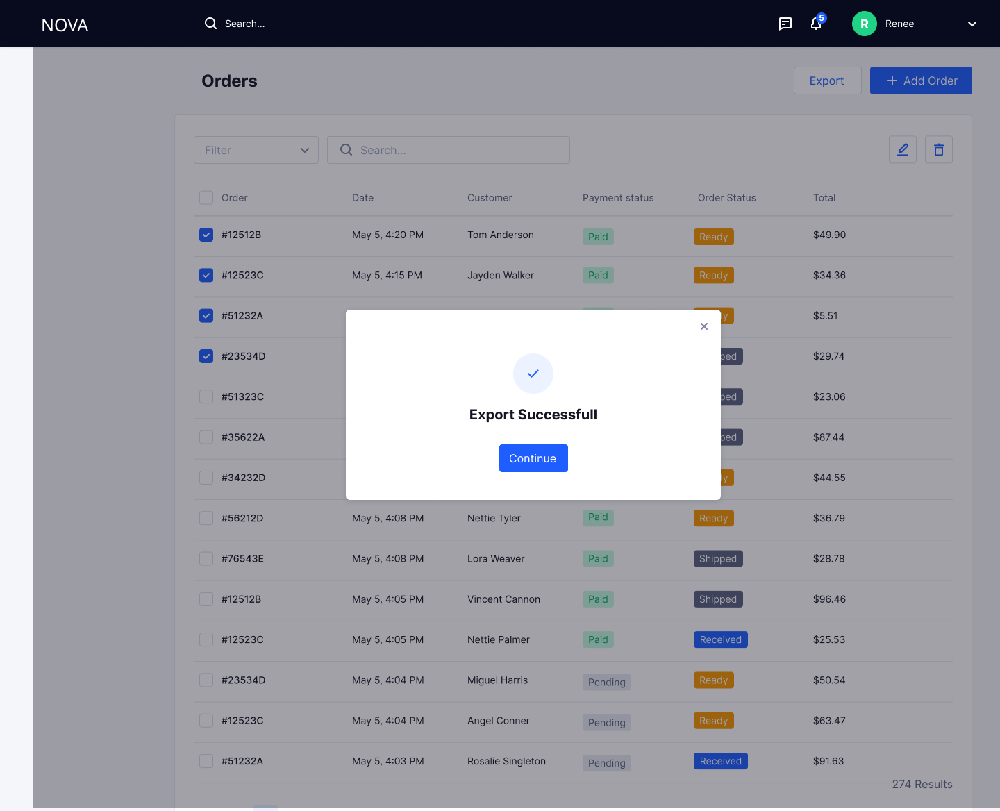
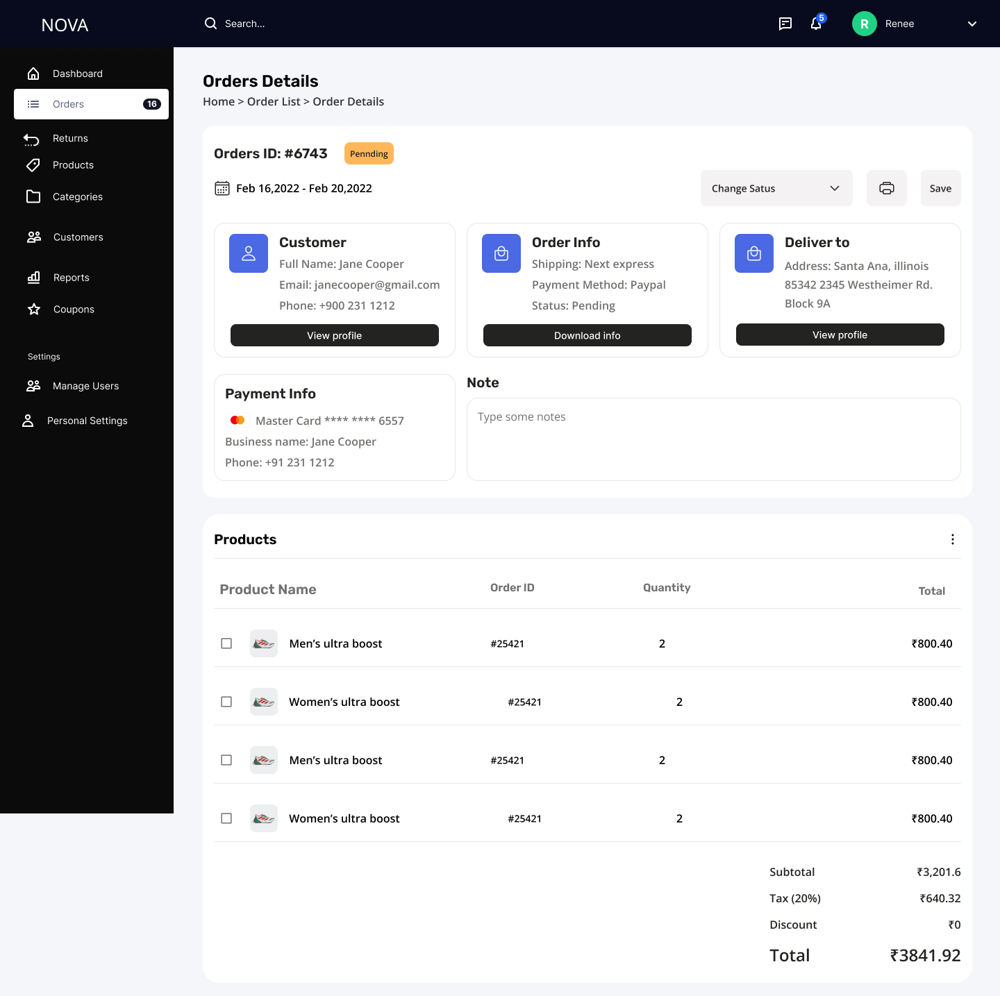

# Admin – Order Management

## Overview

The Order Management module enables admins to manage the complete lifecycle of customer orders and returns. It acts as a centralized system for monitoring, decision-making, and operational control across forward and reverse logistics.

---

## Orders

### Orders List

The Orders List provides a centralized view of all customer orders, enabling admins to monitor, filter, and take actions.

### Wireframe

#### Features

- View all orders in a tabular format  
- Filter orders by status, payment, and date  
- Search by Order ID or Customer  
- Export order data (Excel format)  
- Add manual orders  

#### Actions

- View Order Details  
- Delete Order (restricted)  
- Export Orders  

---

### Export Orders

Admins can export order data for reporting and analysis.

### Wireframe

#### Features

- Export available in **Excel format (.xlsx)**  
- Includes filtered dataset (if filters applied)  

#### User Flow

1. Admin clicks **Export**  
2. System processes data  
3. File is downloaded  

#### Success State

- Message: **"Export Successful"**  
- CTA: Continue  

#### Failure State

- Message: **"Export Failed. Please try again."**  
- CTA: Retry  

#### System Behavior

- Prevents duplicate export clicks while processing  
- Handles large datasets efficiently  

#### Purpose

- Enables offline analysis  
- Supports reporting and audit use cases  

---

### Order Details

The Order Details screen acts as the operational control center for managing individual orders.

### Wireframe

#### Features

- View customer, payment, and delivery details  
- Update order status  
- Add internal admin notes  
- View product-level breakdown  
- Access order summary  

---

### Order Status Management

The order lifecycle is managed directly within the Order Details screen.

#### Stages

- Pending  
- Ready  
- Shipped  
- Delivered  

#### Features

- Status is updated via dropdown  
- Changes require explicit save action  
- Status updates reflect across customer systems  

#### Restrictions

- Status cannot move backward after shipping  
- Delivered orders are locked  

#### Purpose

- Maintains a single source of truth  
- Ensures consistency across systems  
- Enables controlled fulfillment flow  

---

### Admin Notes & Troubleshooting

Admins can add notes directly within the Order Details screen.

#### Features

- Internal notes (not visible to customers)  
- Used for issue tracking and coordination  

#### Use Cases

- Customer complaints  
- Delivery issues  
- Payment discrepancies  

#### Purpose

- Centralizes communication  
- Reduces dependency on external tools  
- Improves resolution time  

---

### Delete Order (Controlled)

Order deletion is allowed only in exceptional scenarios.

### Wireframe

#### Use Cases

- Order created manually by mistake  
- Duplicate order due to API/system glitch  
- Invalid order due to system failure  

#### Conditions

- Order is unpaid or pending  
- Order is not shipped or delivered  

#### User Flow

1. Admin clicks delete  
2. Confirmation modal appears  
3. Admin confirms  
4. Order is removed  

#### Success State

- Message: **"Delete Successful"**  
- CTA: Continue  

#### Failure State

- Message: **"Unable to delete order. Please try again."**  
- CTA: Retry  

#### System Design

- Soft delete (hidden from UI, retained in backend)  
- Action is audit logged  

#### Purpose

- Maintains data integrity  
- Prevents clutter from invalid entries  

---
