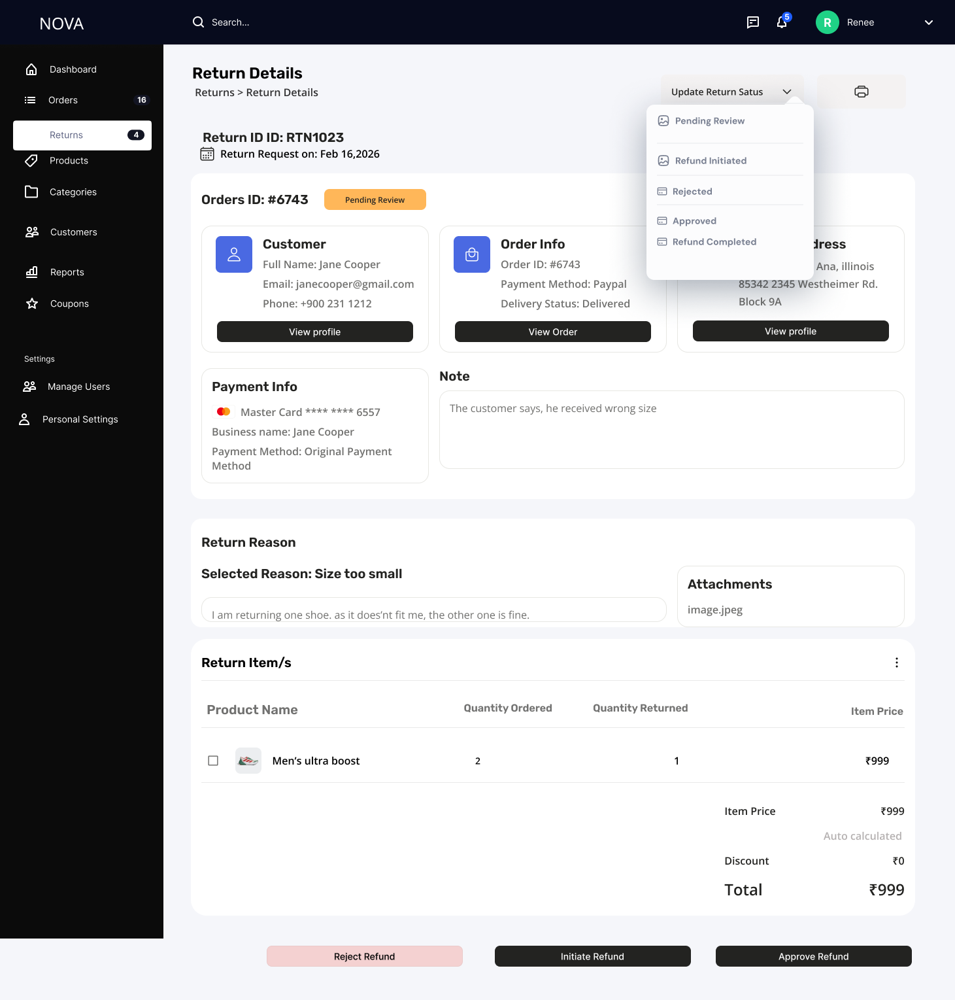
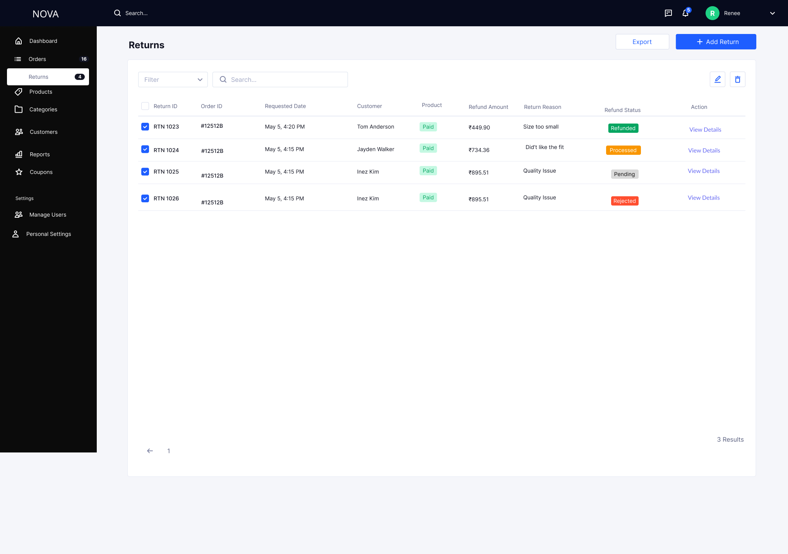

## Returns

### Returns List

The Returns List provides visibility into all return requests and their refund status.

### Wireframe

#### Features

- View all return requests  
- Filter by status and date  
- Search by Return ID / Order ID / Customer  
- Export return data  
- Add manual return  

#### Columns

- Return ID  
- Order ID  
- Customer  
- Refund Amount  
- Return Reason  
- Refund Status  

#### Purpose

- Enables tracking of reverse logistics  
- Provides quick visibility into return volume  

---

### Return Details (Decision Engine)

The Return Details screen acts as a multi-stakeholder decision hub.

### Wireframe

#### Stakeholders

- Customer Support → validates issue  
- Warehouse → verifies returned item  
- Finance → processes refund  
- Admin → decision authority  

---

### Return Validation

Admins evaluate return requests based on provided data.

#### Inputs

- Return reason  
- Customer comments  
- Attachments (proof)  
- Product and quantity details  

#### Features

- Evidence-based validation  
- Partial return handling  
- Linked order reference  

#### Purpose

- Ensures fair decision-making  
- Prevents invalid returns  

---

### Refund Processing

Refunds are triggered after approval.

#### Workflow

Pending Review  
→ Approved  
→ Refund Initiated  
→ Refund Completed  

OR  

Pending Review → Rejected  

---

### Refund Logic

- Refund amount auto-calculated  
- Supports full and partial refunds  
- Processed via original payment method  

---

### SLA (Service Level Agreements)

- Return Review: 24–48 hours  
- Refund Initiation: ≤ 24 hours  
- Refund Completion:
  - UPI/Wallet: 1–2 days  
  - Cards: 3–7 days  

---

### Fraud Detection

The system flags suspicious return behavior.

#### Signals

- High return frequency  
- Quantity mismatch  
- Repeated complaints  
- Missing/invalid attachments  

#### Actions

- Reject return  
- Add notes  
- Escalate to risk team  

---

### Escalation Flow

Used for high-risk or unclear cases.

#### Flow

1. Admin flags issue  
2. Escalates to:
   - Ops Manager  
   - Finance  
   - Risk Team  

---

### Edge Cases

- Failed refund → retry + escalate  
- Partial returns → proportional refund  
- Wrong item returned → reject  
- No item received → hold + escalate  

---

## System Design Principles

- Single source of truth for orders and returns  
- State-driven UI (actions depend on status)  
- Audit-first approach (all actions logged)  
- Integrated forward and reverse logistics  

---

## Purpose

To provide a scalable and reliable system for managing orders and returns while ensuring operational efficiency, fraud control, and seamless coordination across teams.

