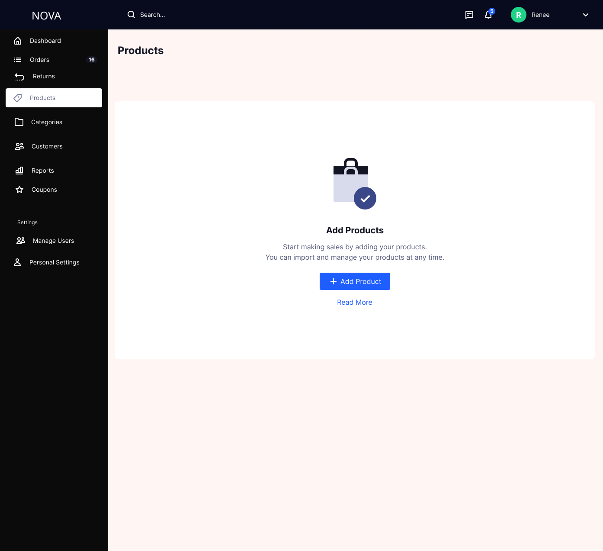
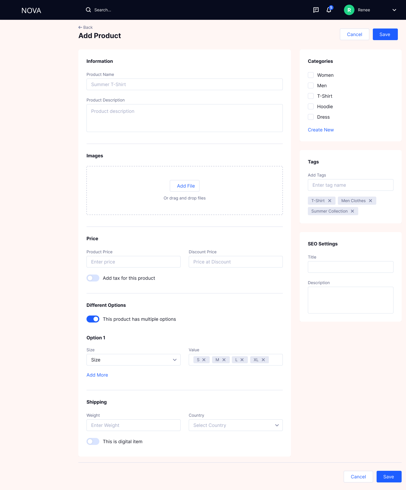
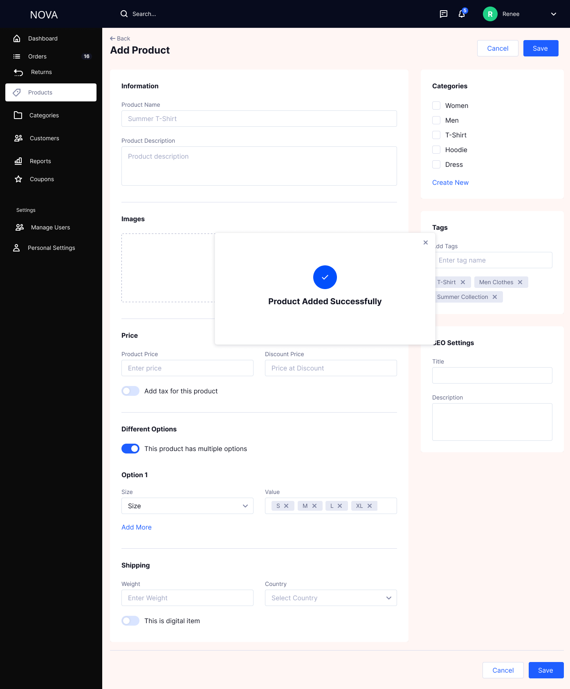

# Products

The Products module enables admins to create, manage, and maintain the product catalog, including pricing, inventory, variants, and SEO configuration.

---
## Empty State

### Features

- Displayed when no products exist  
- CTA: **Add Product**  
- Helps onboard admin

---

## Product List

### Features

- View all products in a tabular format  
- Displays product image, name, category, price, stock status  
- Search and filter functionality  
- Inline actions: Edit / Delete  
- Export products  

---

## Add Product

### Sections

**1. Product Information**
- Product Name  
- Description  

**2. Images**
- Upload product images  
- Drag & drop support  

**3. Pricing**
- Price  
- Discount Price  
- Tax toggle  

**4. Variants**
- Add product options (e.g., Size)  
- Multiple values (S, M, L, XL)  

**5. Shipping**
- Weight  
- Country  
- Digital product toggle  

**6. Categories**
- Assign categories  
- Create new category  

**7. Tags**
- Add searchable tags  

**8. SEO**
- Meta title  
- Meta description  

---

## Product Added Success

### Features

- Confirmation message after product creation  
- Visual success feedback  

---

## Delete Product

### Features

- Confirmation modal before deletion  
- Prevents accidental removal  

---

## Export Products

### Features

- Export product data in Excel format  
- Includes all product details  

---

## Purpose

- Centralized catalog management  
- Supports product lifecycle from creation to deletion  
- Enables business teams to manage inventory and pricing efficiently  
