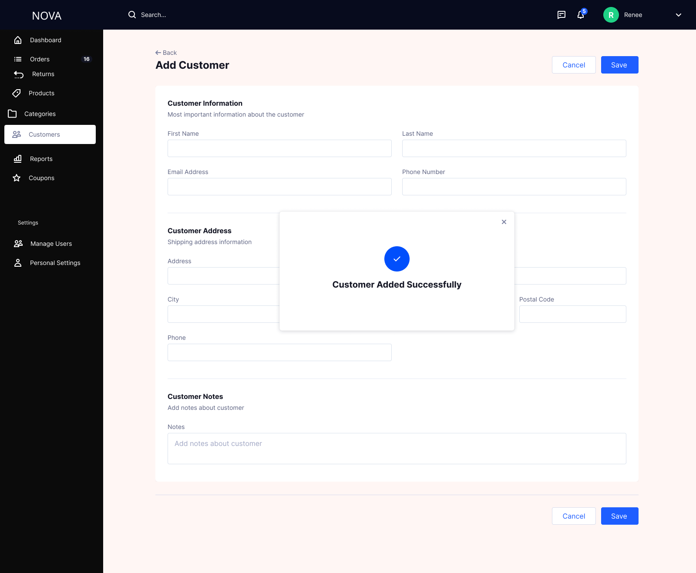

# Customer Management

The Customer Management module enables admins to view, manage, and analyze customer information, including order history, contact details, and engagement.

---

## Customers List

### Features

- View all customers in a tabular format  
- Displays name, location, number of orders, total spend  
- Search and filter functionality  
- Segmentation tabs (New, Returning, Region-based)  
- Export customer data  

---

## Add Customer

### Features

- Add basic customer details (name, email, phone)  
- Add address information  
- Add internal notes  
- Manual onboarding of customers  

---

## Customer Added Success

### Features

- Confirmation after successful creation  
- Visual success feedback  

---

## Customer Details

### Features

- View complete customer profile  
- Customer metadata (location, tenure, rating)  
- Order history with status and pricing  
- Add internal notes for tracking  
- Tag customers (e.g., VIP, Region)  
- Edit customer details  
- Delete customer option  

---

## Business Logic

- Customer must have name and valid contact details  
- Email should be unique per customer  
- Orders are linked to customer profile  
- Deleting customer should not delete order history  

---

## Validation & Error Handling

- Email format validation  
- Prevent duplicate email entries  
- Mandatory fields validation  
- Inline error messages for invalid inputs  

---

## Edge Cases

- Duplicate email → blocked with validation error  
- Missing contact details → prevent submission  
- Customer with no orders → allowed  
- Deleting customer with orders → require confirmation  

---

## Purpose

- Centralized customer data management  
- Enables better customer tracking and segmentation  
- Supports customer service and business insights  
