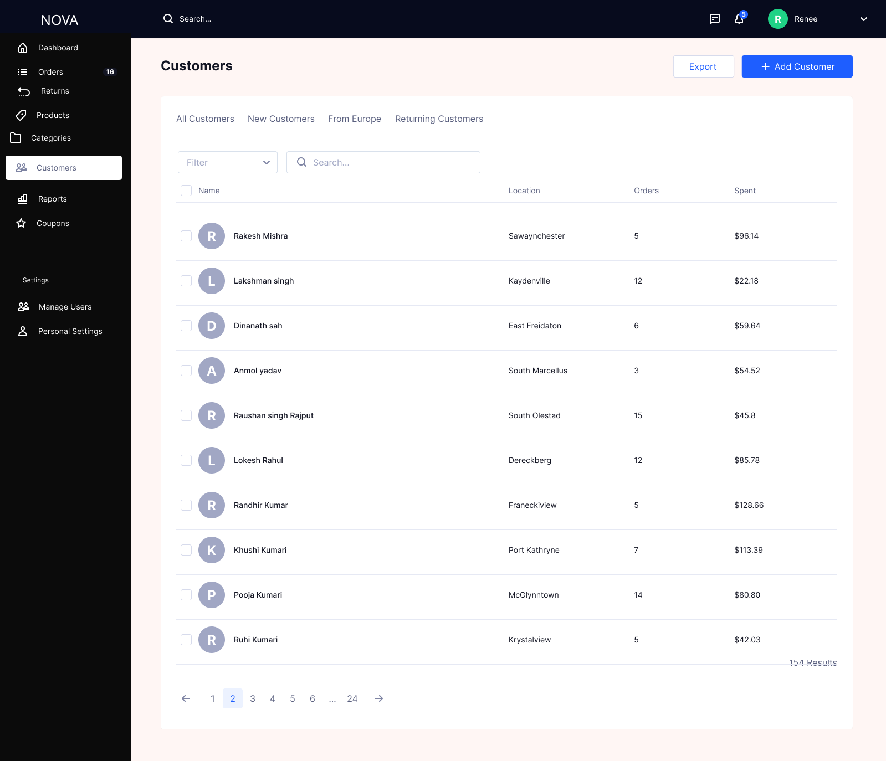
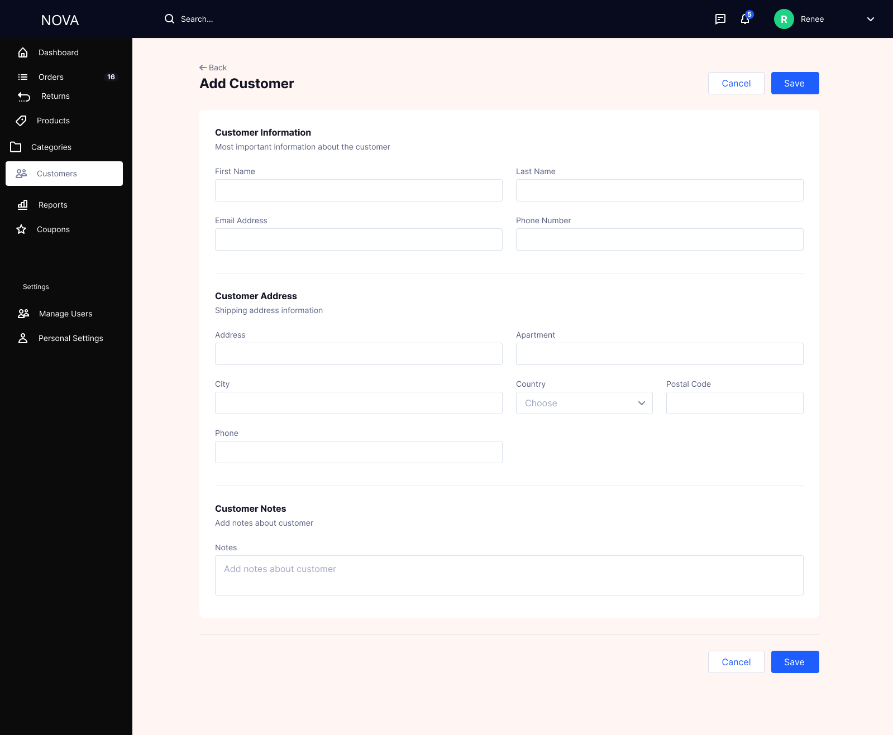
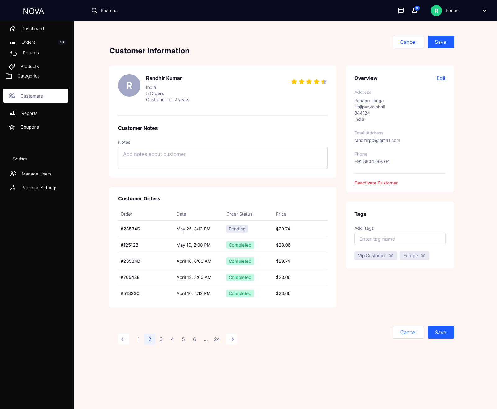
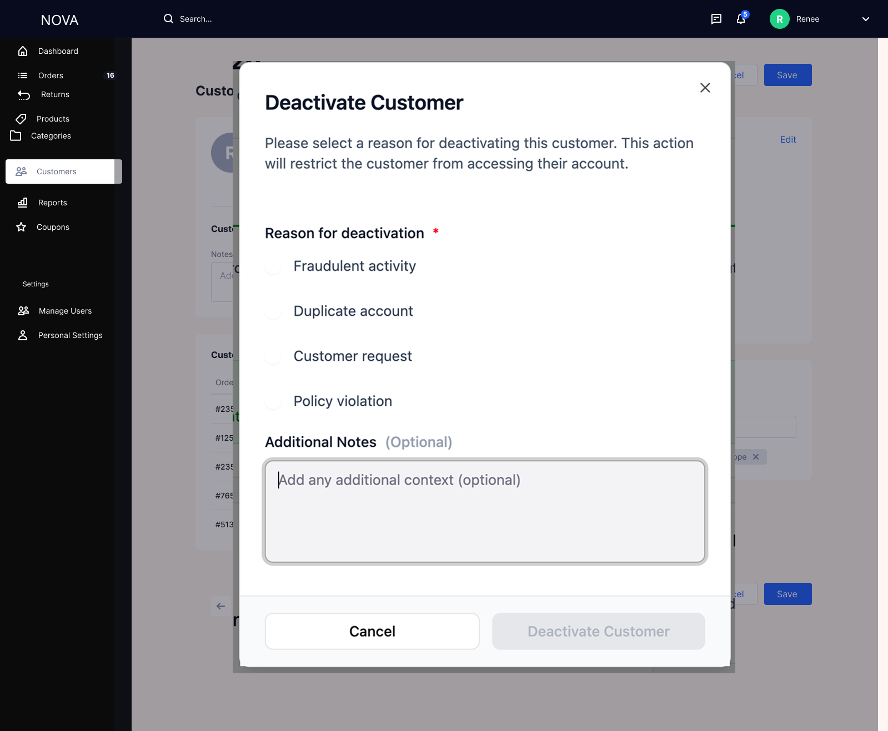

# Customer Management Module

## Overview

The Customer Management module was designed to provide a centralized system for managing customer data across the lifecycle — from onboarding to status control — while ensuring data integrity, operational efficiency, and compliance.

This module enables admin teams to efficiently manage customers, reduce data inconsistencies, and handle risk scenarios such as fraud or duplicate accounts.

Designed a **status-driven Customer Management system** with:

- Centralized customer database  
- Controlled onboarding (manual add with validations)  
- Detailed customer profiles  
- Structured deactivation mechanism instead of deletion  
- Full audit trail for all actions  

---

## Key Features

---

## Customers List

- Centralized view of all customers  
- Search and filter capabilities  
- Segmentation (New, Returning, Region-based)  
- Status visibility (Active / Deactivated)  
- Quick navigation to customer details  

---

## Add Customer

- Manual onboarding with validation  
- Ensures clean and structured data entry  
- Prevents duplicate customer creation  

---

## Customer Details

- Complete customer profile view  
- Order history and engagement tracking  
- Internal notes and tagging for better segmentation  
- Actionable controls (Edit, Deactivate)  

---

## Deactivate Customer

### Why this feature?

Deleting customers creates major risks:
- Breaks linkage with orders and financial data  
- Violates audit and compliance requirements  
- Removes valuable historical insights  

At the same time, not having control over problematic users (fraud, duplicates, misuse) creates operational and risk issues.

### Solution Approach

Instead of deletion, a **controlled deactivation mechanism** was introduced.

### Features

- Mandatory reason selection:
  - Fraudulent activity  
  - Duplicate account  
  - Customer request  
  - Policy violation  
- Optional notes for audit clarity  
- Immediate restriction of access and activity  

### Impact

- Preserves data integrity  
- Enables risk control without data loss  
- Provides traceability for all actions  
- Supports compliance requirements  

---

## ⚙️ System & Business Logic

- Customers are created with **unique email and phone**
- All customer data is persistent (no deletion allowed)
- Deactivation updates status and restricts access
- Orders remain permanently linked to customers
- All actions are logged for audit purposes

---

## 🚨 Edge Case Handling

- Duplicate entries → blocked via validation  
- Missing mandatory fields → prevent submission  
- Already deactivated customer → action restricted  
- Ongoing activity → warning before deactivation  
- System failures → safe error handling without data corruption  

---

## 🔐 Access Control

| Role             | View | Add | Deactivate |
|------------------|------|-----|------------|
| Support Agent     | ✅   | ❌  | ❌         |
| Ops Executive     | ✅   | ✅  | ✅         |
| Risk Team         | ✅   | ❌  | ✅         |
| Super Admin       | ✅   | ✅  | ✅         |

---

## Metrics & Success Indicators 

### Data Quality
- Improved data consistency and accuracy  
- Lower validation error rates over time  

### Risk & Compliance
- Increased tracking of fraud and policy violations  
- 100% audit logging of critical actions  

### Product Impact
- Better customer segmentation and insights  
- Improved admin productivity  
- Safer handling of customer lifecycle  

---

## Key Design Decisions

### 1. No Delete Option
- Ensures historical and financial data integrity  
- Meets compliance and audit requirements  

### 2. Status-Based Model
- Allows controlled restriction without data loss  
- Supports lifecycle management  

### 3. Mandatory Reason for Deactivation
- Enables accountability and traceability  
- Helps in risk analysis and reporting  

---

## Outcome

This module creates a **scalable, compliant, and efficient system** for managing customers, balancing operational needs with data integrity and risk control.

---
