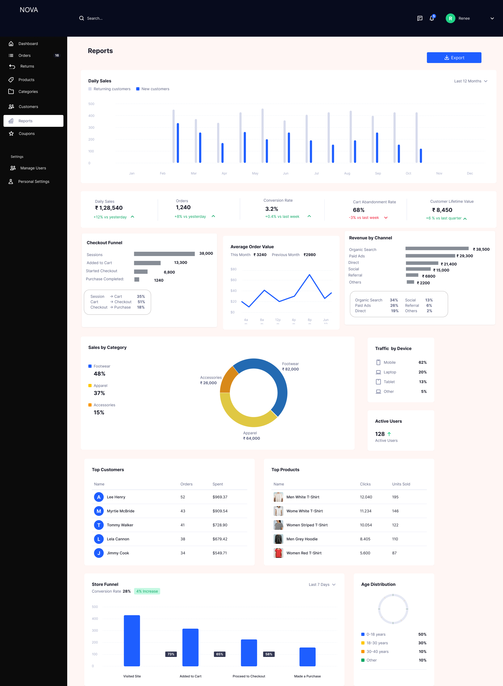
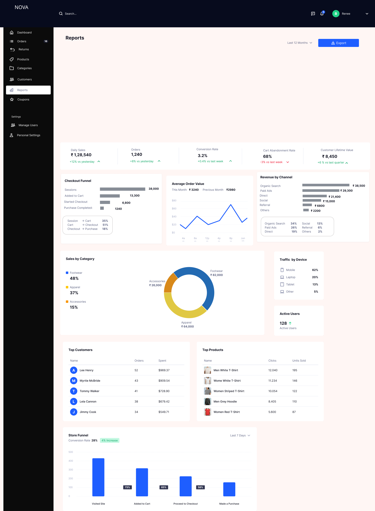
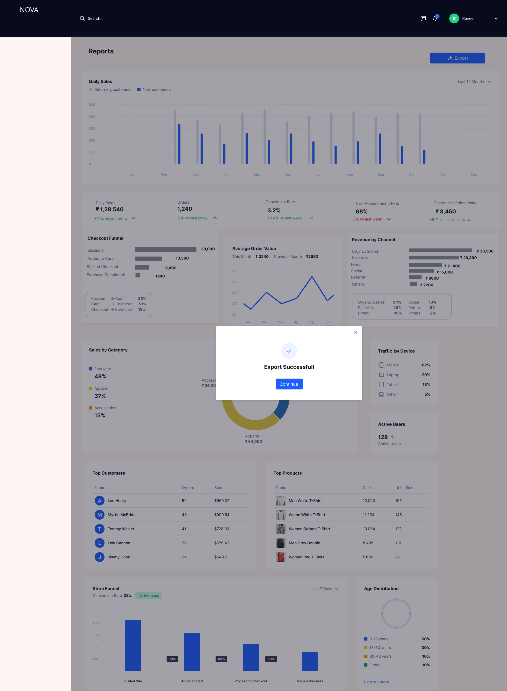

# Reports & Analytics Module

## Overview

The Reports module provides a centralized analytics dashboard for monitoring business performance across sales, customers, and operations. It enables stakeholders to make data-driven decisions using structured metrics, visualizations, and exportable reports.

---

## Problem Statement

Operational teams often lack:

- A unified view of performance metrics  
- Visibility into conversion funnels and customer behavior  
- Real-time insights into revenue and sales trends  
- Reliable mechanisms to export and share reports  

This results in delayed decision-making and reduced operational efficiency.

---

## Solution

A comprehensive reporting dashboard was designed with:

- Key performance indicators (KPIs)  
- Funnel and conversion tracking  
- Revenue breakdowns by channel and category  
- Customer and product-level insights  
- Export functionality for offline analysis  

---

## Reports Dashboard

---

## Key Metrics and Calculation Logic

### Daily Sales
Total revenue generated within the selected time range.

Formula:
Daily Sales = Sum of order value for all completed orders

---

### Orders
Total number of successfully completed orders.

Formula:
Orders = Count of completed orders

---

### Conversion Rate
Percentage of sessions that result in a completed purchase.

Formula:
Conversion Rate = (Total Purchases / Total Sessions) × 100

---

### Cart Abandonment Rate
Percentage of users who added items to cart but did not complete purchase.

Formula:
Cart Abandonment Rate = ((Added to Cart − Purchases) / Added to Cart) × 100

---

### Customer Lifetime Value (CLV)
Average revenue generated per customer.

Formula:
CLV = Total Revenue / Total Customers

---

## Funnel Metrics

### Checkout Funnel Stages

- Sessions  
- Added to Cart  
- Started Checkout  
- Purchase Completed  

### Conversion Calculations

Session to Cart:
(Added to Cart / Sessions) × 100  

Cart to Checkout:
(Started Checkout / Added to Cart) × 100  

Checkout to Purchase:
(Purchases / Started Checkout) × 100  

---

## Revenue Analysis

### Revenue by Channel

Revenue is segmented by acquisition source:

- Organic Search  
- Paid Ads  
- Direct  
- Social  
- Referral  
- Others  

Calculation:
Revenue per channel = Sum of order values grouped by source

---

## Product and Category Insights

### Sales by Category
Displays revenue distribution across product categories to identify high-performing segments.

### Top Products
Ranked based on:
- Number of clicks  
- Units sold  

### Top Customers
Ranked based on:
- Number of orders  
- Total spend  

---

## User Insights

### Traffic by Device
Breakdown of traffic by:
- Mobile  
- Desktop  
- Tablet  
- Others  

### Age Distribution
Customer segmentation based on age groups.

---

## Business Logic

- Only completed orders are considered for revenue calculations  
- Cancelled or refunded orders are excluded  
- Metrics are calculated based on selected time range  
- All KPIs are read-only and derived from system data  
- Funnel stages follow a strict sequential order  
- Data aggregation is consistent across all widgets  

---

## System Logic

- Data is fetched based on selected filters (e.g., last 12 months)  
- Aggregations are computed at the backend level  
- Dashboard loads summary metrics first, followed by detailed components  
- Charts and tables update dynamically based on filters  
- Export captures the current state of the dashboard  

---

## Export Reports

### Features

- Export the current dashboard view  
- Includes:
  - KPI metrics  
  - Charts  
  - Tables  
- Supported formats may include CSV or PDF  

---

## Export Success

- Confirmation displayed after successful export  
- User can continue workflow  

---

## Validation and Error Handling

- Ensure valid date range selection  
- Prevent export when no data is available  
- Validate completeness of data before rendering charts  
- Handle API failures with retry mechanisms  
- Maintain consistency across all widgets  

---

## Edge Cases

- No data available for selected range  
- Partial data loading due to latency  
- Export failure due to system or network issues  
- Sudden metric drops due to incorrect filters  
- Large dataset handling and performance optimization  

---

## Metrics and Success Indicators

### Operational Metrics
- Frequency of report usage  
- Number of exports generated  

### Performance Metrics
- Dashboard load time  
- Query response time  

### Business Impact
- Improved speed of decision-making  
- Increased visibility into revenue and conversion trends  
- Better identification of drop-offs in the funnel  

---

## Design Decisions

### Visual Dashboard
A visual-first approach was used to improve readability and enable faster interpretation of data.

### Funnel-Based Analysis
Funnel tracking helps identify exact stages where user drop-offs occur.

### Export Functionality
Allows stakeholders to share and analyze data outside the system.

---

## Outcome

The Reports module provides structured visibility into business performance, enabling faster and more informed decision-making while improving operational transparency and efficiency.

---
