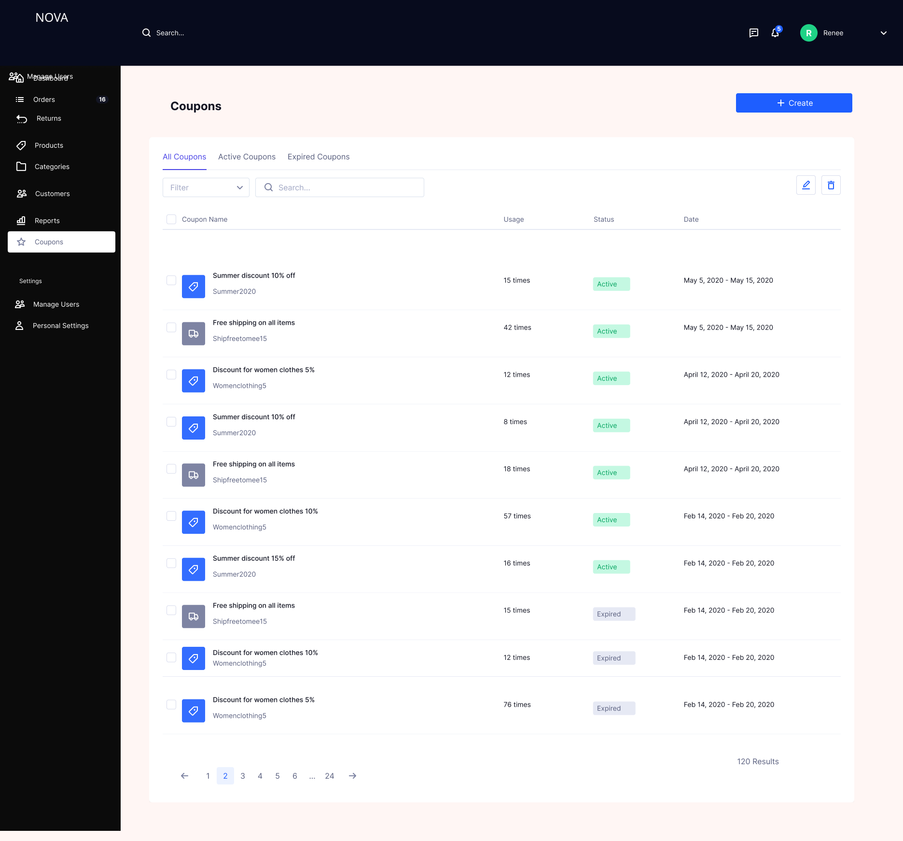
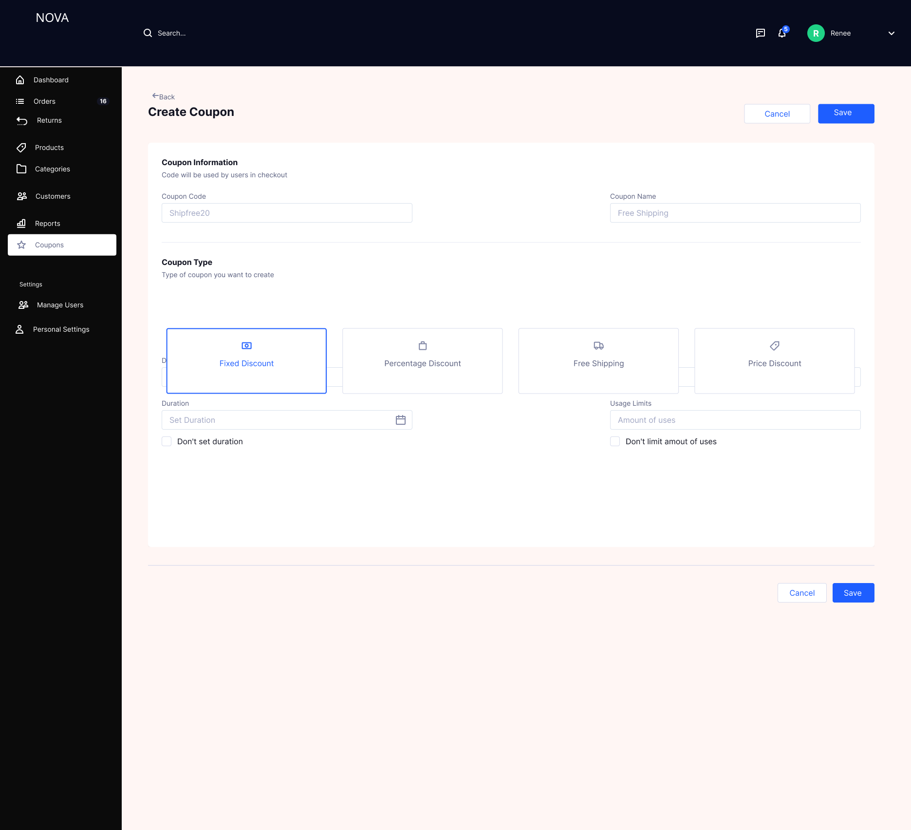

# Coupons Management Module

## Overview

The Coupons Management module enables admins to create, manage, and track discount mechanisms within the platform. It supports different types of promotional strategies while ensuring control over usage, validity, and applicability.

---

## Problem Statement

Without a structured coupon system:

- Promotions cannot be managed centrally  
- Discount misuse or overuse can occur  
- Lack of visibility into coupon performance  
- Difficulty in controlling campaign duration and limits  

This leads to revenue leakage and ineffective promotional strategies.

---

## Solution

A centralized coupon management system was designed to:

- Create multiple types of discounts  
- Control usage limits and duration  
- Track coupon usage and status  
- Provide visibility into active and expired campaigns  

---

## Coupons List

### Features

- View all coupons in a tabular format  
- Segmentation tabs:
  - All Coupons  
  - Active Coupons  
  - Expired Coupons  
- Search functionality  
- Filter options  
- Coupon details displayed:
  - Coupon name  
  - Coupon code  
  - Usage count  
  - Status (Active / Expired)  
  - Validity period  
- Pagination for large datasets  
- Quick actions (edit, delete if applicable)  

---

## Create Coupon

### Features

#### Coupon Information
- Coupon Code (used during checkout)  
- Coupon Name (internal reference)  

#### Coupon Types

- Fixed Discount  
- Percentage Discount  
- Free Shipping  
- Price Discount  

#### Configuration Options

- Duration:
  - Start and end date  
  - Option to set no expiry  

- Usage Limits:
  - Maximum number of uses  
  - Option for unlimited usage  

---

## Business Logic

- Coupon code must be unique  
- Coupon must have a defined type  
- Coupons can be active only within the defined date range  
- Usage count increments on successful order completion  
- Expired coupons cannot be applied  
- Coupons cannot be edited once expired (optional control)  
- Multiple coupons cannot be stacked unless explicitly allowed  

---

## Calculation Logic

### Fixed Discount
Final Price = Order Total − Fixed Amount

---

### Percentage Discount
Final Price = Order Total − (Order Total × Discount %)

---

### Free Shipping
Shipping Cost = 0

---

### Price Discount
Final Price = Predefined discounted price applied to eligible items

---

## System Logic

- On coupon creation:
  - Validate inputs  
  - Store coupon configuration  
  - Set initial status based on date  

- On coupon application (checkout):
  - Validate coupon code  
  - Check:
    - Expiry date  
    - Usage limit  
    - Eligibility conditions  
  - Apply discount to order  

- On order completion:
  - Increment usage count  
  - Log coupon usage  

- Coupon status updates automatically:
  - Active → within date range  
  - Expired → past end date  

---

## Validation and Error Handling

- Coupon code must be unique  
- Mandatory fields must be completed  
- Discount values must be valid:
  - Percentage cannot exceed 100%  
  - Fixed discount cannot exceed order value  
- Date validation:
  - End date must be after start date  
- Usage limit must be a positive number  

---

## Edge Cases

- Coupon applied after expiry → reject  
- Usage limit reached → reject  
- Invalid coupon code → error message  
- Coupon applied to ineligible items → restrict  
- Zero or negative order value after discount → prevent  
- System failure during application → rollback changes  

---

## Status Management

### Status Types

- Active  
- Expired  

### Logic

- Status is derived from current date and validity range  
- No manual status override required  

---

## Metrics and Success Indicators

### Operational Metrics
- Number of coupons created  
- Coupon usage frequency  

---

### Performance Metrics
- Coupon redemption rate  
- Average discount per order  

---

### Business Impact
- Increase in conversion rate  
- Increase in average order value (AOV)  
- Effectiveness of promotional campaigns  

---

## Design Decisions

### 1. Multiple Coupon Types
Supports diverse promotional strategies (flat, percentage, shipping-based)

### 2. Usage Limits
Prevents overuse and revenue leakage  

### 3. Expiry-Based Control
Ensures time-bound campaigns  

### 4. Non-Editable Expired Coupons
Maintains historical accuracy and audit integrity  

---

## Outcome

The Coupons module provides a controlled and flexible system for managing promotions, improving marketing effectiveness while ensuring financial control and system integrity.

---
