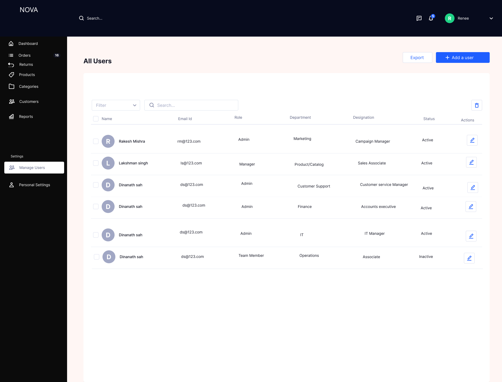
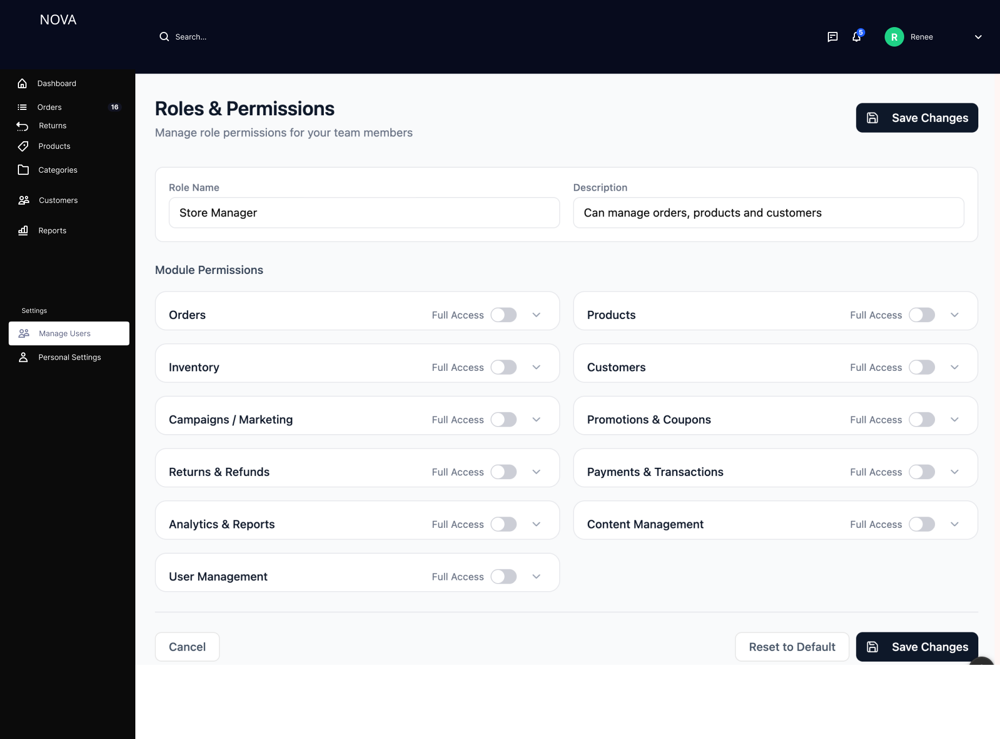
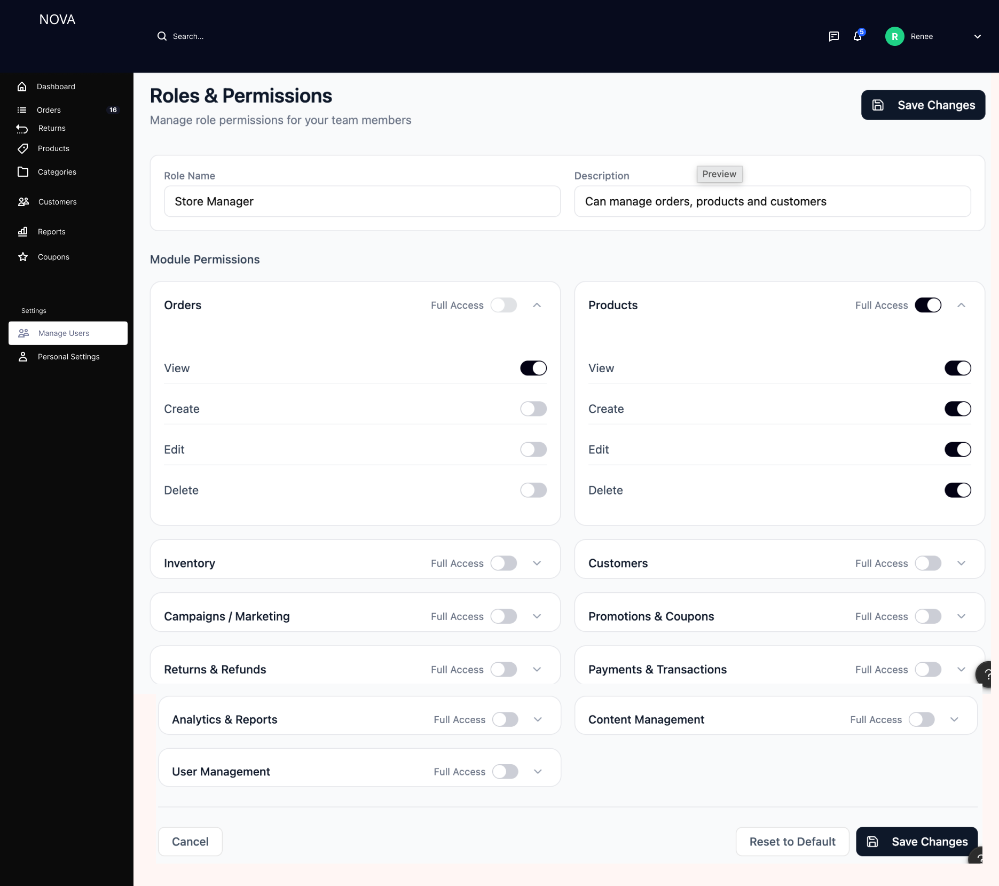

# User Management Module

## Overview

The User Management module enables administrators to manage internal users, assign roles, and control access across different modules of the system. It ensures secure, role-based access while maintaining operational control and accountability.

---

## Problem Statement

In admin systems without structured user management:

- Access control is inconsistent and error-prone  
- Users may have excessive or insufficient permissions  
- No centralized visibility into team roles and responsibilities  
- Security and compliance risks increase  

This leads to operational inefficiencies and potential misuse of system capabilities.

---

## Solution

A role-based user management system was designed to:

- Manage all users from a centralized interface  
- Assign roles and define permissions per module  
- Control access at granular levels (view, create, edit, delete)  
- Ensure security, auditability, and scalability  

---

## Manage Users

### Features

- View all users in a tabular format  
- User details displayed:
  - Name  
  - Email ID  
  - Role  
  - Department  
  - Designation  
  - Status (Active / Inactive)  
- Search functionality  
- Filter options  
- Add new user  
- Edit existing users  
- Export user data  
- Status management (activate/deactivate users)  

---

## Roles and Permissions

### Features

- Create and manage roles  
- Define role name and description  
- Assign permissions at module level  
- Modules include:
  - Orders  
  - Products  
  - Inventory  
  - Customers  
  - Campaigns / Marketing  
  - Promotions & Coupons  
  - Returns & Refunds  
  - Payments & Transactions  
  - Analytics & Reports  
  - Content Management  
  - User Management  

---

## Permission Configuration

### Permission Types

- View  
- Create  
- Edit  
- Delete  

### Full Access

- Enables all permissions within a module  
- Overrides individual toggles  

---

## Business Logic

- Every user must be assigned a role  
- Roles define access across all modules  
- Permissions are enforced at module and action level  
- Users cannot perform actions beyond assigned permissions  
- Inactive users cannot access the system  
- Changes to roles affect all users assigned to that role  

---

## System Logic

- On user creation:
  - Validate user details  
  - Assign role  
  - Set default status as Active  

- On role update:
  - Update permission mappings  
  - Apply changes to all associated users  

- On permission toggle:
  - Update access control configuration  
  - Reflect changes immediately in system behavior  

- On login:
  - System checks role and permissions  
  - Grants or restricts access accordingly  

---

## Access Control Logic

- Role-Based Access Control (RBAC) model is used  
- Each module checks:
  - If user has access  
  - What actions are allowed  

Example:
- If "View" is enabled → user can access module  
- If "Edit" is disabled → user cannot modify data  

---

## Validation and Error Handling

- Email must be valid and unique  
- Mandatory fields must be filled  
- Role selection is required  
- Prevent duplicate user creation  
- Ensure at least one permission is enabled per active role  
- Handle system errors gracefully during updates  

---

## Edge Cases

- User with no permissions → restrict system access  
- Role modified while user is active → apply changes instantly  
- Inactive user attempts login → deny access  
- Conflicting permissions → prioritize role configuration  
- Bulk user updates → ensure consistency  

---

## Status Management

### Status Types

- Active  
- Inactive  

### Behavior

- Active users:
  - Can log in and perform actions based on permissions  

- Inactive users:
  - Cannot access the system  

---

## Metrics and Success Indicators

### Operational Metrics
- Number of active users  
- Role distribution across users  

---

### Security Metrics
- Unauthorized access attempts prevented  
- Permission changes tracked  

---

### Efficiency Metrics
- Time to onboard new users  
- Time to update permissions  

---

## Design Decisions

### Role-Based Access Control
Ensures scalable and manageable permission handling  

### Granular Permissions
Allows fine control over user actions  

### Module-Based Structure
Aligns permissions with system architecture  

### Immediate Permission Application
Ensures real-time enforcement of access control  

---

## Outcome

The User Management module provides a secure and scalable framework for managing users and permissions, improving operational control while ensuring compliance and system integrity.

---
