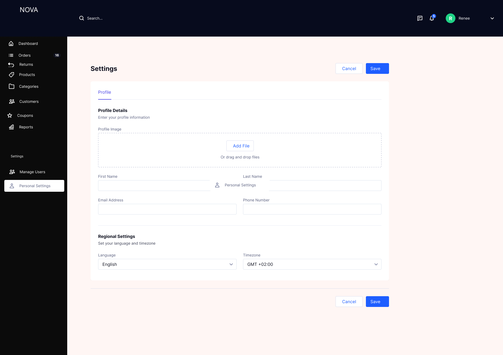

# Personal Settings Module

## Overview

The Personal Settings module allows users to manage their profile information and regional preferences. It ensures that user data remains up-to-date while supporting personalization across the system.

---

## Problem Statement

Without a dedicated settings module:

- User information becomes outdated or inconsistent  
- No control over localization preferences (language, timezone)  
- Poor personalization of system experience  
- Increased dependency on admin for basic profile updates  

---

## Solution

A self-service settings module was designed to:

- Allow users to manage their profile details  
- Support profile image upload  
- Configure regional preferences such as language and timezone  
- Improve personalization and usability  

---

## Profile Settings

---

## Features

### Profile Information

- Upload profile image  
- First Name  
- Last Name  
- Email Address  
- Phone Number  

---

### Regional Settings

- Language selection  
- Timezone selection  

---

### Actions

- Save changes  
- Cancel updates  

---

## Business Logic

- Each user maintains an individual profile  
- Profile updates are user-specific and do not affect others  
- Email is unique and linked to user identity  
- Regional settings impact system display (time, language)  
- Profile image is optional  

---

## System Logic

- On profile update:
  - Validate input fields  
  - Save updated data  
  - Reflect changes immediately  

- On image upload:
  - Store file securely  
  - Associate with user profile  

- On timezone update:
  - Adjust timestamps across system views  

- On language update:
  - Apply localization settings (if supported)  

---

## Validation and Error Handling

- Email must be valid format  
- Phone number must follow valid format  
- Mandatory fields cannot be empty (First Name, Email)  
- File upload validation:
  - Allowed formats (e.g., JPG, PNG)  
  - File size limit  
- Handle upload failures gracefully  

---

## Edge Cases

- Invalid file upload → show error  
- Network failure during save → retry mechanism  
- Partial updates → prevent inconsistent state  
- Unsupported timezone → fallback to default  
- Duplicate email → prevent update  

---

## Security Considerations

- Only authenticated users can update profile  
- Sensitive data (email, phone) must be protected  
- File uploads must be validated and sanitized  

---

## Metrics and Success Indicators

### Usage Metrics
- Frequency of profile updates  
- Profile completion rate  

---

### Experience Metrics
- Reduction in admin dependency for updates  
- Improved user satisfaction  

---

## Design Decisions

### Self-Service Model
Allows users to manage their own information without admin intervention  

### Minimal Required Fields
Reduces friction during updates  

### Regional Customization
Improves usability across different geographies  

---

## Outcome

The Personal Settings module enhances user autonomy and personalization, improving overall system usability while maintaining data accuracy and security.

---
